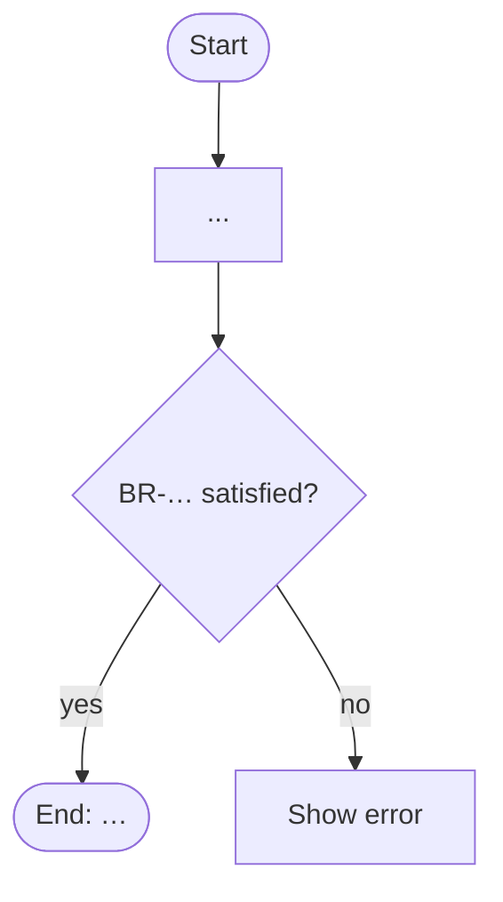

# Step 5.6 — Activity and Validation Analysis

| | |
|---|---|
| Input | Approved UI markdown, `technical/api/<UC>.md`, context package (rules, entities with lifecycle) |
| Output | `ba-ai/specifications/analysis/<UC>-activity.md` |
| Consumers | Acceptance criteria (5.7), compiled spec (5.8), QA test design |

## Procedure

1. Draw the activity flow (Mermaid `flowchart TD`): start → decisions → rule checks → end states. Use the entity lifecycle for state changes.
2. Declare each **validation rule** as `### <UC>-VR-01 — <title>`. Every one must cite the business rule (BR-…) or requirement (REQ-…) it enforces — validation fails otherwise. Say where it runs (client, server, both), the API that enforces it, and the message/error code on failure. The messages must match the UI markdown and the codes must match the API design.
3. Declare each **alternate flow** (`### <UC>-AF-01 — …`) and **error flow** (`### <UC>-EF-01 — …`): trigger/branch point, behaviour, and where it rejoins or ends. Include rule violations, dependency outages, concurrency (someone else changed the data), permission denial.
4. Fill *Business Rule Execution*: for each rule in the context, when and where it is evaluated.
5. Scoped IDs are yours to number (01, 02, …) and must stay stable on later revisions — never renumber existing ones; append new numbers.
6. A rule whose behaviour is ambiguous becomes an open question, not an interpretation.

## Template

````markdown
---
id: <UC>
artifact_type: activity-validation
title: <use case name> — Activity and Validation Analysis
status: DRAFT
version: 1
baseline: TO_BE
origin: AI
relations:
  business_rules: [<BR>, ...]
  entities_read: [<ENT>, ...]
  entities_written: [<ENT>, ...]
  apis: [<API>, ...]
open_questions: []
updated_at: ""
---
# <UC> — <use case name>: Activity and Validation Analysis

## Activity Flow


## Validation Rules

### <UC>-VR-01 — <title>
- **Checks:** …
- **Enforces:** BR-…
- **Where:** client on blur + server in <API>
- **On failure:** "<message>" / 422 <CODE>

## Alternate Flows

### <UC>-AF-01 — <title>
- **Branches at:** main flow step …
- **Flow:** …
- **Rejoins / ends:** …

## Error Flows

### <UC>-EF-01 — <title>
- **Trigger:** …
- **System response:** HTTP status, error code, state unchanged?
- **User sees / can do:** …

## Business Rule Execution
| Rule | Evaluated when | Where | Outcome if violated |
|---|---|---|---|
````
