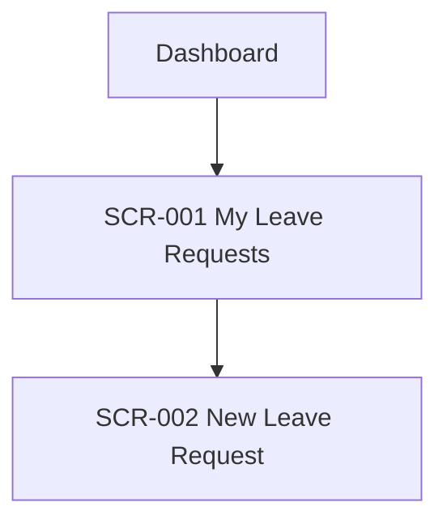

# Phase 4A — Information Architecture

| | |
|---|---|
| Input | Context package `INFORMATION_ARCHITECTURE.yaml`: each application marked `information_architecture: REQUIRED`, with its actors, use cases and existing screens; product overview; security rules (permissions); design system |
| Output | `planning/information-architecture/<APP>.md` per application; planned screens in `ui/screen-catalog.yaml` |
| Consumers | UI design (5.2 reuses these screens and follows the navigation), prototypes (5.3), the user guide (9) |

## Procedure

1. **Structure.** Group the application's use cases into areas from the user's point of view (e.g. "My requests", "Team approvals", "Administration"). Every use case belongs to exactly one area.
2. **Screens.** Plan one screen per distinct place the user goes. A dialog belongs to its screen. Reuse first (`tools/ba find <keywords>`), then register each one so the UI step reuses it instead of inventing its own:
   `tools/ba catalog add screens --data '{"name": "My Leave Requests", "application": "APP-001", "route": "/requests", "purpose": "...", "actors": ["ACT-001"], "use_cases": ["UC-002", "UC-010"]}'`
   Leave out `apis`; step 5.5 fills it in.
3. **Navigation hierarchy and menu**: a Mermaid flowchart from the entry point to every screen, plus the menu as a nested list in display order.
4. **Entry points**: login landing per role, deep links (e.g. from an email notification), and scheduled or system entry.
5. **Role-based visibility**: a matrix of screen or menu item × actor (visible / hidden / read-only). It must agree with `technical/security/security-rules.md`. A role the rules don't cover is an open question (SECURITY or UX).
6. Write the document (template), then `tools/ba stamp` and `tools/ba validate`.

## Template

````markdown
---
id: APP-001
artifact_type: information-architecture
title: <application> — Information Architecture
status: DRAFT
version: 1
baseline: TO_BE
origin: AI
relations:
  screens: [SCR-..., ...]
open_questions: []
updated_at: ""
---
# <application> — Information Architecture

## Application Structure
| Area | Purpose | Use cases | Screens |
|---|---|---|---|

## Navigation Hierarchy


## Menu
- My requests
  - …

## Screen Grouping
| Screen | Area | Route | Use cases |
|---|---|---|---|

## Entry Points
| Entry point | Actor | Lands on |
|---|---|---|

## Role-Based Visibility
| Screen / menu item | ACT-001 | ACT-002 | … |
|---|---|---|---|
````

## Checklist

- [ ] Every use case of the application is reachable from the navigation.
- [ ] Every planned screen is registered in the screen catalog with its use cases.
- [ ] The visibility matrix matches the security rules; gaps are open questions.
