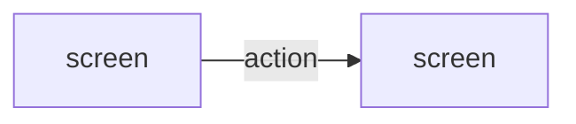

# Step 5.2 — Functional Screen Design (Markdown)

| | |
|---|---|
| Input | Context package `ba-ai/workflow/context/<UC>.yaml`, `ba-ai/ui/design-system.md`, `ba-ai/overview/product-overview.md`, and the application's information architecture when the package lists one (`design_constraints.information_architecture`) |
| Output | `ba-ai/ui/markdown/<UC>.md`, screen entries in `ba-ai/ui/screen-catalog.yaml` |
| Consumers | BA review (GATE-03) → prototype (5.3), sequence (5.4), validation analysis (5.6) |

## Procedure

1. Read the context package. Walk the use case from trigger to outcome and list every screen or dialog the actor needs, plus where each alternate or error path shows up.
2. **Reuse before creating** (Rule 4). Screens planned by the information architecture (Phase 4A) are already in the catalog with their route and use cases: use them and follow its navigation and role visibility. Check `existing_screens`, `other_screens_in_application` and `tools/ba find <keywords>`. Extend an existing screen rather than creating a near-duplicate.
   - Reused screen: `tools/ba catalog update SCR-00x --data '{"use_cases": ["UC-00a", "<UC>"]}'` — lists are replaced, so repeat the existing values.
   - New screen: `tools/ba catalog add screens --data '{"name": "<screen name>", "application": "APP-001", "route": "/<route>", "purpose": "...", "actors": ["ACT-001"], "use_cases": ["<UC>"]}'` prints the new SCR ID. Leave `apis` out; step 5.5 fills it.
   - A dialog that belongs to a screen is a section of that screen, not a separate screen.
3. Write the document with the template below.
   - Every field names its source `ENT-xxx.attribute`.
   - Every validation, message and permission cites its rule (BR-xxx) in the Rule column.
   - Follow the design system's components and patterns by name.
4. **Never invent business decisions** (Rule 1). A missing label, limit, visibility rule or behaviour becomes an open question:
   `tools/ba catalog add open-questions --data '{"question": "...", "reason": "...", "impact_if_unanswered": "...", "target_stakeholder": "BUSINESS", "priority": "MEDIUM", "status": "OPEN", "related": ["<UC>"]}'`
   List its ID in `open_questions` and in the Open Questions section, and show the screen behaviour you assumed meanwhile, marked "pending Q-xxx". Purely presentational choices (column order, icon) need no question.
5. `tools/ba stamp ba-ai/ui/markdown/<UC>.md`, then `tools/ba validate ba-ai/ui/markdown/<UC>.md`. Fix every error.

## Template

````markdown
---
id: <UC>
artifact_type: ui-markdown
title: <use case name> — Functional UI
status: DRAFT
version: 1
baseline: TO_BE
origin: AI
relations:
  business_process: [<BP>]
  business_rules: [<BR>, ...]
  entities_read: [<ENT>, ...]
  entities_written: [<ENT>, ...]
  screens: [<SCR>, ...]
open_questions: []
updated_at: ""
---
# <UC> — <use case name>: Functional UI

## Purpose
What the actor achieves here, where they come from and where they end up.

## Screens

### <SCR> — <screen name>
- **Route / entry point:** `/path` — reached from …
- **Purpose:** …
- **Actors:** <ACT>

#### Sections
1. <section> — what it contains

#### Fields
| Field | Control | Required | Source | Validation | Rule |
|---|---|---|---|---|---|

#### Actions
| Action | Enabled when | Result | Rule |
|---|---|---|---|

#### Table columns
Only for lists: | Column | Source | Sortable | Notes |

#### States
| State | What the user sees |
|---|---|
| Loading | |
| Empty | |
| Validation error | |
| Server error | |
| Success | |

#### Messages
| Trigger | Message text | Type | Rule |
|---|---|---|---|

## Navigation


## Permissions
| Actor / role | Can see | Can do | Rule |
|---|---|---|---|

## Open Questions
- <Q-ID> — question and the behaviour assumed until it is answered (or "None")
````

## Checklist before returning

- Every step of the main flow happens on some screen; every alternate and error flow has a visible outcome.
- Each field has control type, required flag, source attribute, validation and rule.
- Each action says when it is enabled and what happens.
- States: loading, empty, populated, validation error, server error, success.
- Messages say what happened and what to do next.
- Only IDs that exist are mentioned (validation fails on unknown IDs).
