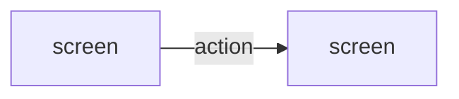

# Step 5.2 — Screen Design (company Mockups Screen format)

| | |
|---|---|
| Input | Context package `ba-ai/workflow/context/<UC>.yaml` (the use case with its object, permissions and allowed states; rules; entities with attribute constraints; messages; existing screens); `other-requirements/field-controls.md`, `message-configuration.md`, `list-behaviour.md`; `technical/design-system.md`; the application's site map (`design_constraints.site_map`) |
| Output | `ba-ai/functional-requirements/mockup-screens/<UC>.md`; screen entries in `functional-requirements/mockup-screens/screen-catalog.yaml`; new messages in `appendices/messages.yaml` |
| Consumers | BA review (GATE-03) → prototype (5.3) → behaviour (5.4), sequence (5.5); one generated page per screen (`mockup-screens/screens/<SCR>.view.md`) and the SRS *Mockups Screen* chapter |

A system use case with no screens has no step 5.2 (D-57): the context package says `ui_required: false`, and the orchestrator does not call you for it.

The screen design follows the company layout (D-51). Each screen is described by its components. A button's *behaviour* is not specified here: the use case's step rules (5.4) say what happens. The screen says when a button is enabled and which use case it triggers.

## Procedure

1. Read the context package. Walk the use case from trigger to outcome and list every screen or dialog the actor needs, plus where each alternate or error path shows up.
2. **Reuse before creating** (Rule 4). Screens planned by the site map (Phase 4A) are already in the catalog: use them and follow the site map's navigation. Check `existing_screens`, `other_screens_in_application` and `tools/ba find <keywords>`. Extend an existing screen rather than creating a near-duplicate.
   - Reused screen: `tools/ba catalog update SCR-00x --data '{"use_cases": ["UC-00a", "<UC>"]}'`. Lists are replaced, so repeat the existing values.
   - New screen, named "<Name> screen": `tools/ba catalog add screens --data '{"name": "Leave request form screen", "application": "APP-001", "route": "/<route>", "purpose": "...", "actors": ["ACT-001"], "use_cases": ["<UC>"]}'`. Leave out `apis`; step 5.6 fills it.
   - A dialog that belongs to a screen is a section of that screen, not a separate screen.
3. **Messages.** Every message the user can see is a catalog item with a code: error dialog EMSG, inline error IEM, confirmation CFD, success dialog SCD, informing or warning INF (`other-requirements/message-configuration.md`). Reuse first (`tools/ba find <words>`; the package lists the existing ones), else `tools/ba catalog add messages --data '{"type": "INLINE_ERROR", "text": "Enter a start date in the future or in the current month."}'`. Never change the text of a message another use case already shows; add a new one instead. A message with a variable part uses a placeholder in braces: `Leave type "{name}" was created.`
4. **Write the document** with the template below. For each screen:
   - **Description** ("This screen allows <actor> to …") and **Access** (the navigation steps or route that reach it).
   - For a list: **Data Source** (which {Object} records, under which conditions, in the company notation: "Retrieve all {Leave Request} records that satisfy [employee] = <Current User>") and **Default Sorting**. Lists follow `list-behaviour.md` unless the screen says otherwise.
   - **Components:** one row per component, in screen order, with the columns # | Component | Component Type | Editable | Mandatory | Default Value | Description.
     - *Component Type* is a control or component type from `field-controls.md` (Single Choice Dropdown List, Free Text (Single Line of Text), Date Time – Date Only, Button, Column Header, Label, …). Validation warns about a type that isn't there; when the product needs a new one, raise it as an open question for the BA (the field controls are GATE-02 content).
     - *Editable* and *Mandatory* are Yes, No or N/A. *Default Value* is a value, a special value (<Today>, <Current User>) or N/A.
     - *Description* says where the value comes from or goes, as the entity attribute (`ENT-006.start_date`): every editable component names one, and validation checks it. Add the value list and its sorting for a dropdown, the constraints the object defines (max length, format), the display format for a column, and the business rules it reflects (BR-…).
     - A **Button** row says when it is enabled and which use case it triggers: "Enabled when every mandatory field is filled. Refer to UC-001." Validation checks the reference. A button only some actors see says so ("Shown to actors with O** on UC-004").
   - **States:** loading, empty, populated, validation error, server error, success, no access — as they apply.
   - **Messages:** | Code | Message | Trigger | Rule |. The Message column repeats the catalog text exactly; validation compares them.
5. **Who can see a screen** follows the permission matrix (the use cases' permissions, GATE-02). Don't repeat it in a Permissions table: put only screen-specific visibility in the components' descriptions.
6. **Never invent business decisions** (Rule 1). A missing label, limit, visibility rule or behaviour becomes an open question:
   `tools/ba catalog add open-questions --data '{"question": "...", "reason": "...", "impact_if_unanswered": "...", "target_stakeholder": "BUSINESS", "priority": "MEDIUM", "status": "OPEN", "related": ["<UC>"]}'`
   List its ID in `open_questions` and in the Open Questions section, and show the behaviour you assumed meanwhile, marked "pending Q-xxx". Purely presentational choices (column order, an icon) need no question.
7. Frontmatter `relations`: business_process, business_rules, entities_read, entities_written, screens, messages.
8. `tools/ba stamp ba-ai/functional-requirements/mockup-screens/<UC>.md`, then `tools/ba validate` on it. Fix every error.

## Template

````markdown
---
id: <UC>
artifact_type: ui-markdown
title: <use case name> — Screen Design
status: DRAFT
version: 1
baseline: TO_BE
origin: AI
relations:
  business_process: [<BP>]
  business_rules: [<BR>, ...]
  entities_read: [<ENT>, ...]
  entities_written: [<ENT>, ...]
  screens: [<SCR>, ...]
  messages: [IEM-001, CFD-002, ...]
open_questions: []
updated_at: ""
---
# <UC> — <use case name>: Screen Design

## Purpose
What the actor achieves here, where they come from and where they end up.

## Screens

### <SCR> — <Name> screen
- **Description:** This screen allows <actor> to …
- **Access:** Step 1: sign in. Step 2: click "…" in the side navigation (route `/path`).
- **Data Source:** Retrieve all {Object} records that satisfy … (lists only)
- **Default Sorting:** Sorted by [Field] in descending order. (lists only)

#### Components
| # | Component | Component Type | Editable | Mandatory | Default Value | Description |
|---|---|---|---|---|---|---|
| 1 | Leave type | Single Choice Dropdown List | Yes | Yes | N/A | Value list: [name] of every {Leave Type} the employee is eligible for (ENT-004.name, BR-004). Sorted alphabetically. |
| 2 | Start date | Date Time – Date Only | Yes | Yes | <Today> | ENT-006.start_date. When the field loses focus and is blank, show IEM-001. |
| 3 | Submit | Button | N/A | N/A | N/A | Disabled until every mandatory field is filled. Refer to UC-001. |

#### States
| State | What the user sees |
|---|---|
| Loading | |
| Empty | |
| Validation error | |
| Server error | |
| Success | |

#### Messages
| Code | Message | Trigger | Rule |
|---|---|---|---|
| IEM-001 | Please input in this field. | A mandatory field is blank | — |

## Navigation


## Open Questions
- <Q-ID> — question and the behaviour assumed until it is answered (or "None")
````

## Checklist before returning

- Every step of the main flow happens on some screen; every alternate and error flow has a visible outcome.
- Every screen has the component table with all seven columns; every editable component names its source attribute; every button refers to a use case.
- Lists state their Data Source and Default Sorting.
- Every message has a code and the catalog's exact text; no message text without a code.
- Only IDs that exist are mentioned (validation fails on unknown IDs).
