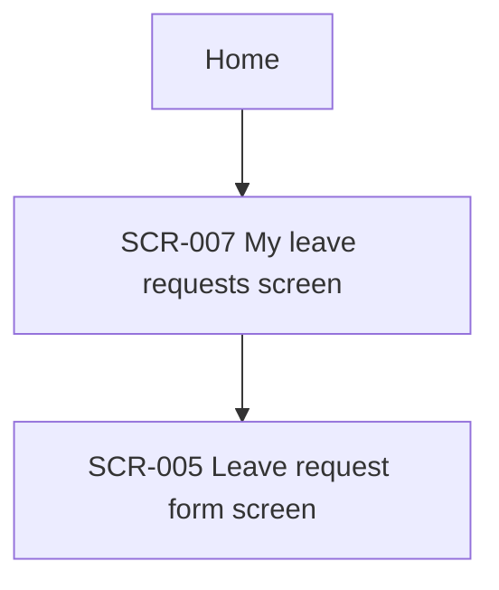

# Phase 4A — Site Map (information architecture)

| | |
|---|---|
| Input | Context package `INFORMATION_ARCHITECTURE.yaml`: each user-facing application with its actors, its use cases (who may perform each, whether it has UI) and its existing screens; the product overview; the permission matrix (`high-level-requirements/permission-matrix.view.md`); the design system |
| Output | `high-level-requirements/site-map/<APP>.md` for every application a HUMAN actor uses (D-58); planned screens in `functional-requirements/mockup-screens/screen-catalog.yaml` |
| Consumers | Screen design (5.2 reuses these screens and follows the navigation), prototypes (5.3), the user guide (9), the SRS publication (High Level Requirements → Site Map) |

The company SRS always has a site map. The application's `information_architecture` flag decides how it is made:
- **REQUIRED** (a new application, or a major navigation change, master §12): design the navigation from scratch.
- **NOT_REQUIRED**: document the navigation the application already has. Change nothing in it.

## Procedure

1. **Structure.** Group the application's use cases into areas from the user's point of view, e.g. "My requests", "Team approvals", "Administration". Every use case with UI belongs to exactly one area. System use cases without screens (`ui_required: false`) are not pages.
2. **Screens.** Plan one screen per distinct place the user goes; a dialog belongs to its screen. Name each one "<Name> screen". Reuse first (`tools/ba find <keywords>`), then register it so step 5.2 reuses it rather than inventing its own:
   `tools/ba catalog add screens --data '{"name": "My leave requests screen", "application": "APP-001", "route": "/requests", "purpose": "...", "actors": ["ACT-001"], "use_cases": ["UC-002", "UC-010"]}'`
   Leave out `apis`; step 5.6 fills them.
3. **Site Map.** A Mermaid flowchart from the home page down, at most three levels deep, as the company template asks.
4. **Pages.** The company table, one row per page or menu entry: **Page** (the screen's name and ID), **Description** ("This screen …", and what the user can start from it), **Permission** (the actors who can open it, from the use cases' permissions). The permission matrix is the source of truth for permissions: don't add a rule it doesn't have. A visibility that the matrix doesn't settle is an open question (SECURITY or UX).
5. **Menu** (a nested list in display order) and **Entry Points** (the landing page per role, deep links such as one from an email, and system entry).
6. Write the document (template), then `tools/ba stamp` and `tools/ba validate`. Validation warns about a screen of the application missing from the Pages table.

## Template

````markdown
---
id: APP-001
artifact_type: site-map
title: <application> — Site Map
status: DRAFT
version: 1
baseline: TO_BE
origin: AI
relations:
  screens: [SCR-..., ...]
open_questions: []
updated_at: ""
---
# <application> — Site Map

## Site Map


## Pages
| Page | Description | Permission |
|---|---|---|
| SCR-007 My leave requests screen | This screen lists the signed-in employee's leave requests. The employee can create a request or open one from here. | Employee, Project Manager |

## Application Structure
| Area | Purpose | Use cases | Screens |
|---|---|---|---|

## Menu
- My requests
  - …

## Entry Points
| Entry point | Actor | Lands on |
|---|---|---|
````

## Checklist

- [ ] Every use case with UI is reachable from the site map; every planned screen is registered with its use cases.
- [ ] Every screen of the application appears in the Pages table, with permissions that agree with the matrix.
- [ ] REQUIRED: navigation designed; NOT_REQUIRED: only documented. Gaps are open questions.
