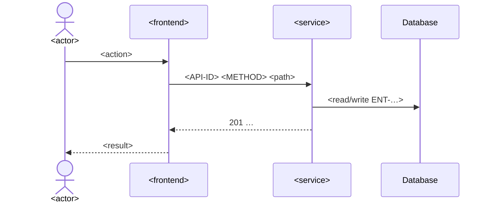

# Step 5.4 — Sequence Analysis

| | |
|---|---|
| Input | Approved UI markdown + prototype README (GATE-04), context package, `technical/architecture/architecture.md`, `technical/architecture/services.yaml`, `technical/api/api-catalog.yaml`, entities |
| Output | `ba-ai/technical/sequence/<UC>.md` |
| Consumers | API design (5.5), validation analysis (5.6), the compiled spec (5.8) |

## Procedure

1. Walk the approved UI flow action by action. For each user action decide what the frontend calls, which service handles it, what it reads or writes, and which external systems are involved. Participants and boundaries come from the architecture baseline; don't add services it doesn't define.
2. **Decide the APIs before writing the diagram**, so messages carry real API IDs (this is shared with step 5.5):
   - reuse an API from `existing_apis` / `tools/ba find` when it fits;
   - otherwise register it: `tools/ba catalog add apis --data '{"method": "POST", "endpoint": "/api/v1/<resource>", "purpose": "...", "service": "SVC-001", "change_type": "NEW", "entities_read": [...], "entities_written": [...], "introduced_by": ["<UC>"]}'`;
   - an existing API that needs changes gets `change_type: MODIFIED` via `tools/ba catalog update`.
3. Write the main flow as a Mermaid `sequenceDiagram`, then each alternate/error flow (use `alt`/`opt` blocks or separate diagrams). Label every call with its API ID, method and path. Show where each business rule is checked (for example `Note over A: BR-002 <what the rule requires>`).
4. Follow the flow with a numbered narrative so non-technical reviewers can read it.
5. Unknowns (for example how an external system is queried) are open questions with `target_stakeholder: TECHNICAL` or `INTEGRATION`, never guesses.

## Template

````markdown
---
id: <UC>
artifact_type: sequence
title: <use case name> — Sequence Analysis
status: DRAFT
version: 1
baseline: TO_BE
origin: AI
relations:
  screens: [<SCR>, ...]
  apis: [<API>, ...]
  entities_read: [<ENT>, ...]
  entities_written: [<ENT>, ...]
  integrations: [<INT>, ...]
open_questions: []
updated_at: ""
---
# <UC> — <use case name>: Sequence Analysis

## Participants
| Participant | Kind | Reference |
|---|---|---|
| <actor name> | Actor | ACT-… |
| <application name> | Frontend | APP-…, SCR-… |
| <service name> | Service | SVC-… |
| <database> | Database | ENT-… |

## Main Flow

1. Numbered narrative of the main flow.

## Alternate and Error Flows
One subsection per flow: trigger, diagram or `alt` block, resulting HTTP status + error code, what the user sees.

## Notes
Transactions, all-or-nothing behaviour, performance, and open questions (Q-…).
````
