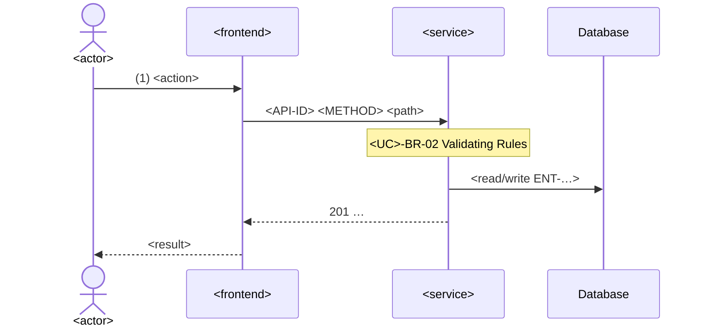

# Step 5.5 — Sequence Analysis

| | |
|---|---|
| Input | The use case behaviour (5.4: activities flow and step rules), the approved screens and prototype when the use case has UI, context package, `technical/architecture/architecture.md`, `technical/architecture/services.yaml`, `technical/api/api-catalog.yaml`, objects |
| Output | `ba-ai/technical/sequence/<UC>.md` |
| Consumers | API design (5.6), the compiled spec (5.8), the SA at GATE-06 |

The behaviour says *what* the system does at each step (D-48). The sequence says *which component does it and through which call*. Derive it; don't redesign the behaviour.

## Procedure

1. Walk the activities flow step by step. For each system step and its step rules, decide what the frontend calls, which service handles it, what it reads or writes, and which external systems are involved. Participants and boundaries come from the architecture baseline; don't add services it doesn't define. A system use case (no screens) starts at its scheduler or event, not at a user.
2. **Decide the APIs before writing the diagram**, so messages carry real API IDs (this is shared with step 5.6):
   - reuse an API from `existing_apis` / `tools/ba find` when it fits;
   - otherwise register it: `tools/ba catalog add apis --data '{"method": "POST", "endpoint": "/api/v1/<resource>", "purpose": "...", "service": "SVC-001", "change_type": "NEW", "entities_read": [...], "entities_written": [...], "introduced_by": ["<UC>"]}'`;
   - an existing API that needs changes gets `change_type: MODIFIED` via `tools/ba catalog update`.
3. Write the main flow as a Mermaid `sequenceDiagram`, then each alternate and error flow (use `alt`/`opt` blocks or separate diagrams). Label every call with its API ID, method and path. Show where each step rule runs, by its ID: `Note over A: UC-001-BR-03 Validating Rules`. Emails appear as a call to the notification service with their ET ID.
4. Follow the flow with a numbered narrative keyed to the activities-flow steps ("(3) …"), so non-technical reviewers can read it.
5. Unknowns (for example how an external system is queried) are open questions with `target_stakeholder: TECHNICAL` or `INTEGRATION`, never guesses. A step rule that can't be implemented as written is an open question for the BA, not a quiet change.

## Template

````markdown
---
id: <UC>
artifact_type: sequence
title: <use case name> — Sequence Analysis
status: DRAFT
version: 1
baseline: TO_BE
origin: AI
relations:
  screens: [<SCR>, ...]
  apis: [<API>, ...]
  entities_read: [<ENT>, ...]
  entities_written: [<ENT>, ...]
  integrations: [<INT>, ...]
open_questions: []
updated_at: ""
---
# <UC> — <use case name>: Sequence Analysis

## Participants
| Participant | Kind | Reference |
|---|---|---|
| <actor name> | Actor | ACT-… |
| <application name> | Frontend | APP-…, SCR-… |
| <service name> | Service | SVC-… |
| <database> | Database | ENT-… |

## Main Flow

1. Numbered narrative of the main flow, keyed to the activities-flow steps.

## Alternate and Error Flows
One subsection per AF/EF: trigger, diagram or `alt` block, resulting HTTP status and error code, what the user sees (its message code).

## Notes
Transactions, all-or-nothing behaviour, performance, and open questions (Q-…).
````
