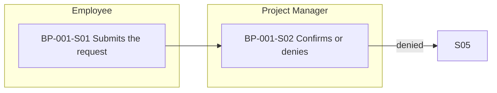

# Step 3.2 — Business Processes and Workflows

| | |
|---|---|
| Input | Future need and gap analysis from the elicitation summary, requirements, actors |
| Output | `high-level-requirements/business-processes.yaml` (BP, with steps `<BP>-S01`, …); `high-level-requirements/workflows/<BP>.md`, one per process |
| Consumers | The BA at GATE-02; use cases (3.6, each belongs to a process); the graph (`ProcessStep TRIGGERS UseCase`); context packages (5.1); the SRS (High Level Requirements → Workflow) |

## Procedure

1. A process is an end-to-end business flow with a trigger and an outcome. "Leave request and approval" is a process; "submit leave request" is a use case inside it.
2. Add the process with its steps. Leave out the step IDs, and the tool numbers them `<BP>-S01`, `-S02`, …:
   ```
   tools/ba catalog add business-processes --data '{
     "name": "...", "objective": "...", "actors": ["ACT-..."], "trigger": "...",
     "steps": [{"name": "Employee submits the request", "actor": "ACT-001"},
               {"name": "Project Manager confirms or denies", "actor": "ACT-002",
                "next": [{"to": "S03", "when": "confirmed"}, {"to": "S05", "when": "denied"}]},
               …]}'
   ```
3. **Branches** (D-56). By default a step leads to the next one. A step with alternatives lists them in `next`, each with `to` (a step of the same process — `S03` while the process is new, `BP-001-S03` afterwards — or `END`) and `when` (the condition). Exceptions that don't change the path ("auto-confirmed when the requester is the Project Manager") stay in the step's `name` or `description`.
4. **After the use cases exist**, link each step to the use cases it triggers, and set `related_use_cases`. The `steps` list is replaced, so repeat every step with its existing ID:
   `tools/ba catalog update BP-001 --data '{"steps": [{"id": "BP-001-S01", "name": "...", "actor": "ACT-001", "use_cases": ["UC-001"]}, …], "related_use_cases": ["UC-001", …]}'`
5. **Workflow document**, one per process: `high-level-requirements/workflows/<BP>.md` (the user asked for one file per workflow). It has two sections:
   - **Workflow Diagram:** a Mermaid swimlane flowchart. One `subgraph` per actor (the lanes), one node per step labelled with its step ID and name, the arrows of the default order and the branches with their `when`. Every step of the process appears: validation checks every step ID is in the document.
   - **Workflow Explanation:** the company's bullet list. What each actor does, in order, with the conditions under which the flow moves on or goes back: "After Employee submits the request (BP-001-S01), the selected Project Manager … If denied, …".
   Stamp it: the stamp records the process, so changing the process makes the workflow STALE.
6. Write the processes in TO-BE only. The current process belongs in the elicitation summary's *Current Need*.

## Workflow template

````markdown
---
id: BP-001
artifact_type: workflow
title: <process name> — Workflow
status: DRAFT
version: 1
baseline: TO_BE
origin: AI
open_questions: []
updated_at: ""
---
# <process name> — Workflow

## Workflow Diagram


## Workflow Explanation
- After the Employee submits a leave request (BP-001-S01), …
````

## Checklist

- [ ] Every process has a trigger, actors, an objective and ordered steps; every branch has a condition.
- [ ] Every step names its actor, and every step that a user or system performs is linked to a use case.
- [ ] Every process has its workflow document, showing every step, stamped.
- [ ] TO-BE only.
