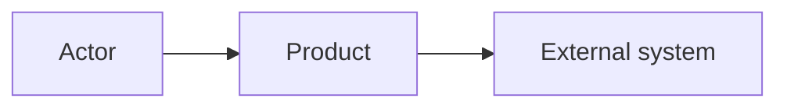

# Steps 3.1 and 3.7 — Product Overview, Actors, Applications, Integrations

| | |
|---|---|
| Input | Elicitation summary, `requirements/requirements.yaml`, open questions, assumptions (context package `OVERVIEW.yaml`) |
| Output | `overview/actors.yaml` (ACT), `overview/applications.yaml` (APP), `overview/integrations.yaml` (INT), `overview/product-overview.md` |
| Consumers | The BA at GATE-02, technical baseline (6A), information architecture (4A), every use-case context package |

## Procedure

1. **Actors.** Every human role and every external system that acts on the product:
   `tools/ba catalog add actors --data '{"name": "Employee", "type": "HUMAN", "description": "..."}'`
   (`type` is HUMAN or SYSTEM). A scheduler or batch job that triggers behaviour is a SYSTEM actor.
2. **Applications.** Each separately deployed user-facing application:
   `tools/ba catalog add applications --data '{"name": "...", "type": "WEB", "description": "...", "actors": ["ACT-..."], "information_architecture": "REQUIRED"}'`
   - `type` is WEB, MOBILE, DESKTOP or BACKOFFICE.
   - Set `information_architecture: REQUIRED` for a **new** application, or one whose navigation changes substantially (master §12). Phase 4A then designs its navigation. Otherwise use NOT_REQUIRED.
3. **Integrations (3.7).** Each external system exchange:
   `tools/ba catalog add integrations --data '{"name": "...", "direction": "OUTBOUND", "purpose": "...", "owner": "...", "protocol": "SMTP (if known)", "data_exchanged": "...", "dependency": "what breaks without it", "entities": ["ENT-..."]}'`
   - `direction` is INBOUND, OUTBOUND or BIDIRECTIONAL.
   - Add `entities` after the data model exists (`catalog update`).
   - An unknown protocol or owner is an open question (INTEGRATION).
   - No integrations at all is fine: run `tools/ba catalog init integrations`. GATE-02 reviews the catalog, so it must exist, even empty, to record that there are none.
4. **Product overview.** Write the document with the template, after the other catalogs exist, so it can cite their IDs. Keep it a summary: the catalogs hold the detail.
5. `tools/ba stamp ba-ai/overview/product-overview.md` → `tools/ba validate`.

## Template

````markdown
---
id: PRODUCT
artifact_type: product-overview
title: <product> — Product Overview
status: DRAFT
version: 1
baseline: TO_BE
origin: AI
open_questions: [Q-..., ...]
assumptions: [ASM-..., ...]
updated_at: ""
---
# <product> — Product Overview

## Objective
<why the product exists; the business goals it serves (REQ-...)>

## Scope
**In scope:** …  
**Out of scope:** … (say what was explicitly excluded, with its source)

## Actors
| Actor | Type | Role in the product |
|---|---|---|

## Applications
| Application | Type | Used by | Information architecture |
|---|---|---|---|

## System Boundaries
<what the product owns vs. what external systems own; Mermaid C4-style context diagram>



## Integrations
| Integration | Direction | Purpose | Data | Protocol | Owner |
|---|---|---|---|---|---|

## High-Level Behavior
<the main processes (BP-...) in a few sentences each, and the use cases they contain>
````

## Checklist

- [ ] Every actor named in a requirement exists as an ACT. No duplicate roles.
- [ ] Each application lists its actors and has `information_architecture` set.
- [ ] Unknown integration details are open questions, never guesses.
