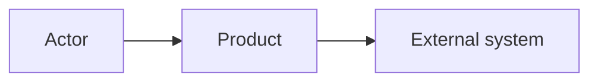

# Steps 3.1 and 3.7 — Product Overview, Actors, Applications, Integrations

| | |
|---|---|
| Input | Elicitation summary, `input-management/elicitation/requirements.yaml`, the glossary, open questions, assumptions (context package `OVERVIEW.yaml`) |
| Output | `high-level-requirements/actors.yaml` (ACT), `applications.yaml` (APP), `integrations.yaml` (INT), `product-overview.md` |
| Consumers | The BA at GATE-02; the generated Object Relationship Diagram and Actor page; technical baseline (6A); site map (4A); every use-case context package; the SRS Introduction (the overview's Objective and Scope) |

## Procedure

1. **Actors.** Every human role and every system that acts on the product:
   `tools/ba catalog add actors --data '{"name": "Employee", "type": "HUMAN", "description": "...", "role_mapping": "the HR role assignments include EMPLOYEE"}'`
   - `type` is HUMAN or SYSTEM. A scheduler or batch job that triggers behaviour, and an external system that acts on the product, are SYSTEM actors.
   - `role_mapping` (required for HUMAN, D-56) completes the company's sentence "The system recognises the user as <actor> when …". It names the data the role comes from: a role assignment, a group in the identity provider, a field. An unknown source is an open question (SECURITY), never a guess.
   - Don't write the actor's permissions in the description: they are generated from the use cases' permissions (the permission matrix).
2. **Applications.** Each separately deployed user-facing application:
   `tools/ba catalog add applications --data '{"name": "...", "type": "WEB", "description": "...", "actors": ["ACT-..."], "information_architecture": "REQUIRED"}'`
   - `type` is WEB, MOBILE, DESKTOP or BACKOFFICE.
   - Every application a HUMAN actor uses gets a site map (Phase 4A, D-58). `information_architecture: REQUIRED` means its navigation is designed from scratch: a **new** application, or one whose navigation changes substantially (master §12). `NOT_REQUIRED` means the site map documents the navigation it already has.
3. **Integrations (3.7).** Each external system exchange:
   `tools/ba catalog add integrations --data '{"name": "...", "system": "HR System", "direction": "OUTBOUND", "purpose": "...", "owner": "...", "protocol": "SMTP (if known)", "data_exchanged": "...", "dependency": "what breaks without it", "entities": ["ENT-..."]}'`
   - `system` is the external system's name, as the Object Relationship Diagram shows it.
   - `direction` is INBOUND, OUTBOUND or BIDIRECTIONAL.
   - Add `entities` after the data model exists (`catalog update`).
   - An unknown protocol or owner is an open question (INTEGRATION).
   - No integrations at all is fine: run `tools/ba catalog init integrations`. GATE-02 reviews the catalog, so it must exist, even empty, to record that there are none.
4. **Product overview.** Write the document with the template, after the other catalogs exist, so it can cite their IDs. Keep it a summary: the catalogs and the generated views hold the detail. Its *Objective* and *Scope* become the SRS Introduction's Overview, so write them for the customer.
5. `tools/ba stamp ba-ai/high-level-requirements/product-overview.md` → `tools/ba validate`.

## Template

````markdown
---
id: PRODUCT
artifact_type: product-overview
title: <product> — Product Overview
status: DRAFT
version: 1
baseline: TO_BE
origin: AI
open_questions: [Q-..., ...]
assumptions: [ASM-..., ...]
updated_at: ""
---
# <product> — Product Overview

## Objective
<why the product exists; the business goals it serves (REQ-...)>

## Scope
**In scope:** …  
**Out of scope:** … (say what was explicitly excluded, with its source)

## Actors
| Actor | Type | Role in the product |
|---|---|---|

## Applications
| Application | Type | Used by | Navigation (site map) |
|---|---|---|---|

## System Boundaries
<what the product owns vs. what external systems own; Mermaid C4-style context diagram>



## Integrations
| Integration | System | Direction | Purpose | Data | Protocol | Owner |
|---|---|---|---|---|---|---|

## High-Level Behavior
<the main processes (BP-...) in a few sentences each, and the use cases they contain; the workflows
are in high-level-requirements/workflows/>
````

## Checklist

- [ ] Every actor named in a requirement exists as an ACT, with no duplicate roles; every HUMAN actor has its role mapping.
- [ ] Each application lists its actors and has `information_architecture` set.
- [ ] Unknown integration details are open questions, never guesses.
