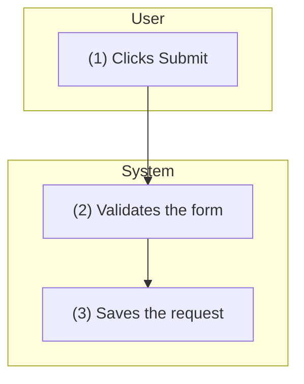

# Step 5.4 — Use Case Behaviour

| | |
|---|---|
| Input | Approved screens `functional-requirements/mockup-screens/<UC>.md` (GATE-03) and prototype (GATE-04), or none for a system use case (`ui_required: false`, D-57); the context package: the use case with its object, permissions, allowed states, transitions and `follows`; its policy rules; the common rules; the common use cases; the message and email catalogs; the entities with their lifecycle |
| Output | `ba-ai/functional-requirements/use-case-specifications/<UC>/behaviour.md`; new messages and email templates in the catalogs |
| Consumers | Sequence (5.5) and API (5.6), which are derived from it; acceptance criteria (5.7); the compiled specification (5.8); QA (8.1) |

The behaviour is the BA's part of the specification: what the system must do at each step, in the company's words. It comes right after the approved screens and before any technical design, which is derived from it (D-48). Each step rule says what happens at one step of the flow. Validation rules are step rules of type Validating (D-47).

## Procedure

1. **Use case description.** Three fields, in the company notation:
   - **Trigger:** the action that starts it: a button on a screen ("User clicks "Submit" on SCR-005"), a schedule or an event for a system use case.
   - **Pre-condition:** what must hold: "User signed in as Employee. [Status] of the {Leave Request} is "Denied"."
   - **Post-condition:** the result: "The {Leave Request} is submitted with [Status] "Pending confirmation"."
2. **Activities flow.** Number the steps (1), (2), … from the trigger to the end, alternating actor and system. Branches are sub-steps: (4.1), (4.2). Draw it as a Mermaid flowchart with one swimlane per participant (`subgraph User` / `subgraph System`). Each node label starts with its step number. Follow it with the same steps as a numbered list.
3. **Step rules.** One section `### <UC>-BR-nn — <Type> Rules` for each step that has behaviour to specify:
   - `- **Step:** (n)`. For several steps: `(4), (4.1)`. For a change to a common use case's step: `CMUC-002 (4)`.
   - `- **Type:**` one of Screen Displaying, Validating, Confirmation, Processing, Display/Search, Scheduled.
   - `- **State change:** FROM -> TO` when the step changes the object's state. It must be a transition of the object's lifecycle, and every transition in the use case's `transitions` appears in one rule.
   - Then the rule itself, in the company notation: [Field], {Object}, "Value", <Special Value>. Cite every message by its code (IEM-…, EMSG-…, CFD-…, SCD-…, INF-…), every email by ET-…, every policy or common rule by BR-…, and screens by SCR-….
   - The title names the type in the company's words: "Screen Displaying Rules", "Validating Rules", "Confirmation Message Displaying Rules", "Submitting Rules", "Creating Rules", "Approving Rules", "Auto-Closing Rules".
   - A Validating rule names its fields, its conditions and the message shown when a condition fails. A Confirmation rule names its CFD and what each answer does.
   - IDs are stable: keep existing numbers on revisions and append new ones.
4. **Messages.** Reuse the messages the approved screens show, with the same codes. A new message (an error dialog, a success dialog) is added after `tools/ba find`: `tools/ba catalog add messages --data '{"type": "ERROR_DIALOG", "text": "…"}'`. Never change the text of a message an approved screen shows: that makes the screen STALE. Create a new message instead.
5. **Email templates.** For each email the use case sends, reuse an existing template (`tools/ba find`) or add one, following `company-standards/email-templates.md`:
   ```
   tools/ba catalog add email-templates --data '{
     "name": "Sending email to Project Manager after leave request is submitted",
     "trigger": "UC-001 step (6): the request is submitted",
     "to": "Selected Project Manager: [email] of {Employee} that satisfies [employee_id] = [selected_project_manager] of the current {Leave Request}",
     "subject": "[LRMS] Leave request from <<Employee Name>> needs your confirmation",
     "body": "Dear <<Project Manager Name>>, …",
     "placeholders": [{"name": "Employee Name", "source": "ENT-002.full_name of the requester"}, …]}'
   ```
   Every placeholder names its source: an object attribute (`ENT-002.full_name`) or a special value (`<Link to SCR-004>`). An unknown recipient, subject or wording becomes an open question; never invent it.
6. **Alternate flows** `### <UC>-AF-nn — title` (branch point, flow, where it rejoins) and **error flows** `### <UC>-EF-nn — title` (trigger, system response, what the user sees with its message code). Include rule violations, a dependency outage, concurrent changes and permission denial.
7. **Delta specification** (the use case `follows` common use cases, D-50). Write only what differs from them: the use case's own steps, and the rules that change a CMUC step, keyed `CMUC-002 (4)`. Write "Steps (1)–(3) as CMUC-002" for the steps that don't differ. Name every followed CMUC in the document. The compiled specification shows the CMUC steps inline, so developers still read one complete document.
8. **System use case** (no screens, D-57). The trigger is the schedule ("Every Friday at 18:00, company time zone") or the event. A Scheduled rule states which records it selects and what it does to each.
9. **Frontmatter `relations`:** business_rules, entities_read, entities_written, screens, messages, email_templates, common_use_cases. Validation warns about a code used but not listed.
10. `tools/ba stamp ba-ai/functional-requirements/use-case-specifications/<UC>/behaviour.md`, then `tools/ba validate` on it.

## Template

````markdown
---
id: <UC>
artifact_type: use-case-behaviour
title: <use case name> — Use Case Behaviour
status: DRAFT
version: 1
baseline: TO_BE
origin: AI
relations:
  business_rules: [BR-…]
  entities_read: [ENT-…]
  entities_written: [ENT-…]
  screens: [SCR-…]
  messages: [IEM-…, CFD-…]
  email_templates: [ET-…]
  common_use_cases: [CMUC-…]
open_questions: []
updated_at: ""
---
# <UC> — <use case name>: Use Case Behaviour

## Use Case Description
- **Trigger:** User clicks "Submit" on SCR-005.
- **Pre-condition:** User signed in as Employee.
- **Post-condition:** The {Leave Request} is submitted.

## Activities Flow

1. (1) User clicks "Submit" on SCR-005.
2. (2) System validates the form.
3. (3) System saves the request and emails the Project Manager.

## Business Rules

### <UC>-BR-01 — Validating Rules
- **Step:** (2)
- **Type:** Validating

The system validates every field as stated in SCR-005. If [Start date] is before the first day of the current month, show IEM-003 under [Start date] (BR-001).

### <UC>-BR-02 — Submitting Rules
- **Step:** (3)
- **Type:** Processing
- **State change:** (new) -> PENDING_CONFIRMATION

The system creates a {Leave Request} with all entered data and [Status] "Pending confirmation", logs the audit trail as BR-023, and sends ET-001.

## Alternate Flows

### <UC>-AF-01 — <title>
- **Branches at:** step (2)
- **Flow:** …
- **Rejoins / ends:** …

## Error Flows

### <UC>-EF-01 — <title>
- **Trigger:** …
- **System response:** …, EMSG-…
- **User sees / can do:** …
````

## Checklist

- [ ] Every step of the activities flow that has behaviour has a step rule, and every step rule's step is in the flow (or in a followed CMUC).
- [ ] Every Validating rule names its message; every Confirmation rule its CFD and both answers.
- [ ] Every email has an ET with its recipients, subject and body, and every placeholder bound to its source.
- [ ] Every transition in the use case's `transitions` appears as a State change; every policy BR of the use case is applied by a step rule.
- [ ] Nothing contradicts the approved screens or prototype, and nothing is invented: unknowns are open questions.
