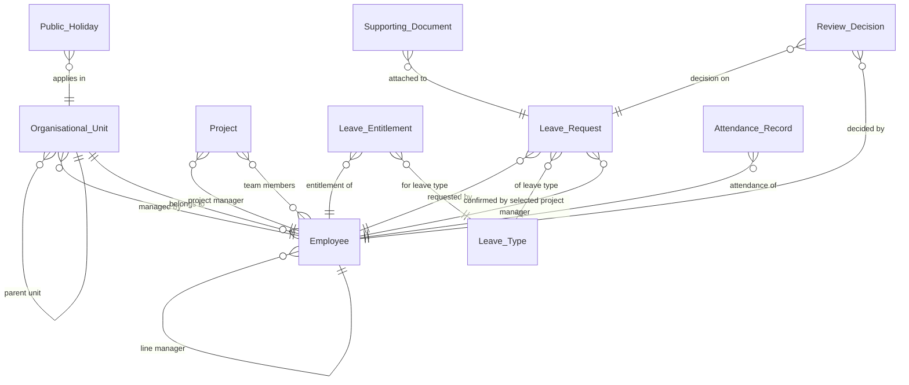

<!-- GENERATED by tools/ba from entities.yaml. Do not edit: change the YAML, then run `tools/ba sync`. -->
# Data Model — Entities

10 items · Status: APPROVED · GATE-02: APPROVED

_Read-only view of [entities.yaml](entities.yaml), regenerated by `tools/ba sync`. Edit the YAML, not this file._

## Summary

| ID | Name | Owner | Description |
|---|---|---|---|
| [ENT-001](#ENT-001) | Organisational Unit | HR System (external). Held read-only in this system. | A node of the company structure: country, city, office, department or unit, taken as it is in the HR system. Used for role-based access and for reporting. A Line Manager manages a Business Unit. |
| [ENT-002](#ENT-002) | Employee | HR System (external). Held read-only in this system. | A person who uses the system, from the HR system. Carries the data that leave eligibility and the review workflow depend on. |
| [ENT-003](#ENT-003) | Project | HR System (external). Held read-only in this system. | A project team, from the HR system. An employee chooses the confirming Project Manager among the managers of the projects they belong to. |
| [ENT-004](#ENT-004) | Leave Type | Leave Request Management System | A kind of leave with its own eligibility rules and documentation requirements, configured by Admin/HR. Suggested types: Paid, Unpaid, Maternity, Paternity, Sick (with Hospital Certificate), Bereavement, Study, Personal. |
| [ENT-005](#ENT-005) | Leave Entitlement | Leave Request Management System | The leave an employee is entitled to for one leave type in one year. Calculated by the system at the annual refresh as base days plus one day per N years of service; not imported. It does not change during the year when seniority changes. |
| [ENT-006](#ENT-006) | Leave Request | Leave Request Management System | An employee's request for leave over a date range. It passes through confirmation by the selected Project Manager, unless the employee belongs to no project, and approval by the Line Manager. |
| [ENT-007](#ENT-007) | Supporting Document | Leave Request Management System | A file uploaded with a leave request when the leave type requires documentation, e.g. a hospital certificate. |
| [ENT-008](#ENT-008) | Review Decision | Leave Request Management System | One review action on a leave request: the Project Manager's confirmation or denial, or the Line Manager's approval or rejection. |
| [ENT-009](#ENT-009) | Attendance Record | Card Scanner System (external) | Check-in and check-out times of an employee for one day, provided by the card scanner system. Read-only in this system. |
| [ENT-010](#ENT-010) | Public Holiday | HR System (external). Held read-only in this system. | A public holiday in one country, from the HR system. Weekends and public holidays are not working days, so leave is not counted on them and they are not reported as absences. |

## Relationships

## Details

### ENT-001 — Organisational Unit

**Attributes:**

| Name | Type | Description |
|---|---|---|
| unit_id | identifier |  |
| name | string |  |
| level | enum | Levels named in the URS: company, country, city, office, department, unit |
| parent_unit | reference | Parent Organisational Unit |
| manager | reference | Employee who manages this unit. Sets which unit a Line Manager sees in reports. |

**Relationships:**

| To | Cardinality | Description |
|---|---|---|
| [Organisational Unit](#ENT-001) | N:1 | parent unit |
| [Employee](#ENT-002) | N:1 | managed by |

### ENT-002 — Employee

**Attributes:**

| Name | Type | Description |
|---|---|---|
| employee_id | identifier |  |
| full_name | string |  |
| email | string | Address for notification emails |
| gender | enum | Drives eligibility for gender-specific leave types |
| seniority | integer | Years of service. Basis of seniority-based entitlement. |
| roles | list of enum | EMPLOYEE, PROJECT_MANAGER, LINE_MANAGER, ADMIN_HR. A Line Manager is never a Project Manager. |
| organisational_unit | reference |  |
| line_manager | reference | Employee who approves this employee's confirmed requests |

**Relationships:**

| To | Cardinality | Description |
|---|---|---|
| [Organisational Unit](#ENT-001) | N:1 | belongs to |
| [Employee](#ENT-002) | N:1 | line manager |

### ENT-003 — Project

**Attributes:**

| Name | Type | Description |
|---|---|---|
| project_id | identifier |  |
| name | string |  |
| project_manager | reference | Employee |
| members | list of reference | Employees in the project team |

**Relationships:**

| To | Cardinality | Description |
|---|---|---|
| [Employee](#ENT-002) | N:1 | project manager |
| [Employee](#ENT-002) | N:M | team members |

### ENT-004 — Leave Type

**Attributes:**

| Name | Type | Description |
|---|---|---|
| leave_type_id | identifier |  |
| name | string |  |
| gender_eligibility | enum | Which genders may use this type, e.g. Maternity Leave is for female employees only |
| base_days | decimal | Yearly entitlement before seniority, in days |
| seniority_based | boolean | Whether the entitlement grows with years of service, e.g. Paid Leave |
| years_per_extra_day | integer | N: one extra day for every N years of service. Used when the type is seniority-based. |
| required_documents | list | Documents the employee must upload, e.g. a hospital certificate |

### ENT-005 — Leave Entitlement

**Attributes:**

| Name | Type | Description |
|---|---|---|
| entitlement_id | identifier |  |
| employee | reference |  |
| leave_type | reference |  |
| year | integer |  |
| entitled_amount | decimal | Days, in steps of 0.5 |

**Relationships:**

| To | Cardinality | Description |
|---|---|---|
| [Employee](#ENT-002) | N:1 | entitlement of |
| [Leave Type](#ENT-004) | N:1 | for leave type |

### ENT-006 — Leave Request

**Attributes:**

| Name | Type | Description |
|---|---|---|
| request_id | identifier |  |
| employee | reference |  |
| leave_type | reference |  |
| start_date | date |  |
| end_date | date |  |
| day_part | enum | ALL_DAY, MORNING or AFTERNOON. How it applies to a request spanning several days is settled in the use case specification. |
| selected_project_manager | reference | Chosen by the employee among the Project Managers of their projects. Empty when the employee belongs to no project. |
| status | enum | See lifecycle |
| exceeds_entitlement | boolean | Set when the request exceeds the employee's entitlement; such requests are reviewed manually |
| submitted_at | datetime |  |
| cancellation_reason | enum | BY_EMPLOYEE or REVIEW_DEADLINE_PASSED |
| cancelled_at | datetime |  |

**Relationships:**

| To | Cardinality | Description |
|---|---|---|
| [Employee](#ENT-002) | N:1 | requested by |
| [Leave Type](#ENT-004) | N:1 | of leave type |
| [Employee](#ENT-002) | N:1 | confirmed by selected project manager |

**Lifecycle:**

- **States:** PENDING_CONFIRMATION, PENDING_APPROVAL, DENIED, APPROVED, REJECTED, CANCELLED
- **Transitions:**
  - (new) -> PENDING_CONFIRMATION: Employee submits
  - (new) -> PENDING_APPROVAL: Project Manager submits for themselves (auto-confirmed)
  - (new) -> PENDING_APPROVAL: Employee who belongs to no project submits (no confirmation step)
  - PENDING_CONFIRMATION -> PENDING_APPROVAL: Project Manager confirms
  - PENDING_CONFIRMATION -> DENIED: Project Manager denies
  - PENDING_APPROVAL -> APPROVED: Line Manager approves
  - PENDING_APPROVAL -> REJECTED: Line Manager rejects
  - DENIED -> PENDING_CONFIRMATION: Employee modifies and resubmits
  - REJECTED -> PENDING_CONFIRMATION: Employee modifies and resubmits
  - REJECTED -> PENDING_APPROVAL: Employee with no confirmation step modifies and resubmits
  - PENDING_CONFIRMATION -> CANCELLED: Employee cancels
  - PENDING_APPROVAL -> CANCELLED: Employee cancels
  - PENDING_CONFIRMATION -> CANCELLED: System, when the month of the leave start date ends
  - PENDING_APPROVAL -> CANCELLED: System, when the month of the leave start date ends
- **Invalid transitions:**
  - APPROVED -> CANCELLED: an approved request cannot be cancelled

### ENT-007 — Supporting Document

**Attributes:**

| Name | Type | Description |
|---|---|---|
| document_id | identifier |  |
| leave_request | reference |  |
| document_type | string | Which required document this file satisfies |
| file | file |  |
| uploaded_at | datetime |  |

**Relationships:**

| To | Cardinality | Description |
|---|---|---|
| [Leave Request](#ENT-006) | N:1 | attached to |

### ENT-008 — Review Decision

**Attributes:**

| Name | Type | Description |
|---|---|---|
| decision_id | identifier |  |
| leave_request | reference |  |
| step | enum | CONFIRMATION or APPROVAL |
| outcome | enum | CONFIRMED, DENIED, APPROVED or REJECTED |
| decided_by | reference | Employee; empty when auto-confirmed |
| auto_confirmed | boolean | True when a Project Manager's own request was confirmed automatically |
| decided_at | datetime |  |

**Relationships:**

| To | Cardinality | Description |
|---|---|---|
| [Leave Request](#ENT-006) | N:1 | decision on |
| [Employee](#ENT-002) | N:1 | decided by |

### ENT-009 — Attendance Record

**Attributes:**

| Name | Type |
|---|---|
| employee | reference |
| work_date | date |
| check_in_time | datetime |
| check_out_time | datetime |
| total_presence_hours | decimal |

**Relationships:**

| To | Cardinality | Description |
|---|---|---|
| [Employee](#ENT-002) | N:1 | attendance of |

### ENT-010 — Public Holiday

**Attributes:**

| Name | Type | Description |
|---|---|---|
| holiday_date | date |  |
| name | string |  |
| country | reference | Organisational Unit at country level where the holiday applies |

**Relationships:**

| To | Cardinality | Description |
|---|---|---|
| [Organisational Unit](#ENT-001) | N:1 | applies in |
