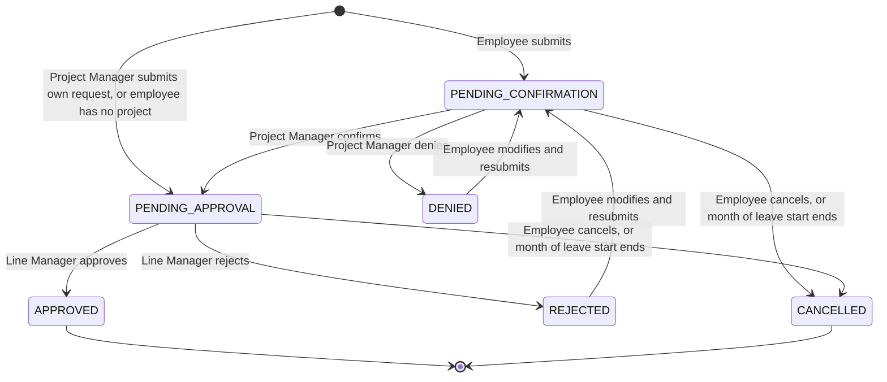

# Leave Request Management System — Product Overview

Drafted from the client's User Requirement Specification v1.0 and revised with the BA's decisions at and after the first GATE-02 review. Where a BA decision differs from the URS, the decision wins and the rule's source says so. Everything still unsettled is recorded as an open question or an assumption.

## Objective

Manage the full lifecycle of employee leave requests, from submission to approval, in line with company policy and with more transparency than today.

The current process is manual, inconsistent and prone to delays. The new system should:

- automate the leave request workflow across all levels;
- validate requests against rules and make policy transparent;
- support differentiated roles: employee, project manager, line manager, Admin/HR;
- send regular notifications to ensure compliance;
- accept requests that exceed the entitlement, with manual review;
- improve visibility into absence without approved leave.

## Scope

In scope:

| Area | Requirements | Use cases |
|---|---|---|
| Leave request submission, status and resubmission | REQ-001, REQ-002, REQ-004 | UC-001, UC-002, UC-003 |
| Cancelling a request, by the employee or at the review deadline | REQ-018, REQ-003 | UC-010, UC-011 |
| Two-step review: confirmation, then approval | REQ-003, REQ-009 | UC-004, UC-005 |
| Annual leave entitlement refresh | REQ-006 | UC-006 |
| Leave type management | REQ-007 | UC-007 |
| Weekly attendance-based notification | REQ-005, REQ-011, REQ-016 | UC-008 |
| Leave statistics reporting | REQ-010 | UC-009 |

Cross-cutting requirements with no use case of their own: role-based access (REQ-008), multinational organisational structure (REQ-012), scale to 33,000 users and concurrent submissions (REQ-013), web-based and mobile-responsive (REQ-014), sign-in through company single sign-on (REQ-015), employee, organisation and public holiday data from the HR system (REQ-019), English only (REQ-017).

Out of scope:

- Processing logic of card scanner data. The system only uses the data provided.
- Importing entitlement amounts. The URS described a yearly import; the BA replaced it with calculation by the system (REQ-006, ASM-011).
- Maintaining employees, the organisational structure, project teams, role assignments and public holidays. They come from the HR system (BR-020).
- Sign-in screens and password management. Users sign in through the company's single sign-on (ASM-006).
- Languages other than English.

Not yet decided, so not in the use case list:

- Configuring notification emails (Q-013).
## Actors

| Actor | Type | Role |
|---|---|---|
| ACT-001 Employee | Human | Submits leave requests, views their status, cancels them until approved, receives the weekly notification |
| ACT-002 Project Manager | Human | Confirms or denies requests of the team members who selected them. Also an employee |
| ACT-003 Line Manager | Human | Approves or rejects requests. Manages a Business Unit; sees reports for that unit |
| ACT-004 Admin/HR | Human | One role. Manages leave types with their entitlement rules; views reports |
| ACT-005 Card Scanner System | System | Provides check-in and check-out times |
| ACT-006 System Scheduler | System | Starts scheduled jobs: the weekly notification, the month-end cancellation and the annual entitlement refresh |

A Line Manager is never a Project Manager and does not submit leave requests (BR-019).

## Applications

APP-001 Leave Request Management Web Application: one web-based, mobile-responsive application with role-specific screens for every human actor (ASM-002). English only.

- Employees: request form and their own requests.
- Project Managers and Line Managers: a dashboard that shows by default only the requests needing their action, with filters for request type, employee name, date and status (BR-013).
- Admin/HR: leave type management.
- Admin/HR and Line Managers: reporting screens.

## System Boundaries

Inside the system:

- leave requests, supporting documents and review decisions (ENT-006, ENT-007, ENT-008);
- leave types with their eligibility, entitlement and documentation rules (ENT-004);
- leave entitlements per employee, leave type and year, calculated by the system (ENT-005);
- the weekly matching of attendance against leave requests, and the resulting notifications;
- leave reports.

Outside the system:

- employees, organisational units, projects and public holidays (ENT-002, ENT-001, ENT-003, ENT-010): the HR system owns them and this system only reads them (BR-020);
- user authentication: the company's single sign-on (INT-004);
- recording and processing of check-in and check-out times: the card scanner system owns attendance records (ENT-009);
- delivery of emails (INT-002).

The company is multinational, with offices in multiple cities across several countries. Access and reporting can be scoped by country, city or office (BR-014), and the system must scale to 33,000 users (REQ-013). Leave rules are the same in every country (BR-003).

## Integrations

| Integration | Direction | Purpose | Open points |
|---|---|---|---|
| INT-001 Card scanner attendance data | Inbound | Check-in and check-out times, used to determine off-work days | Interface, frequency and employee identifier: Q-012 |
| INT-002 Notification email delivery | Outbound | Workflow emails and the weekly notification | Mail service, what is configurable, emails on cancellation: Q-013 |
| INT-003 HR system master data | Inbound | Employees, organisation, project teams, line managers, roles, public holidays | Interface and frequency: Q-015 |
| INT-004 Company single sign-on | Bidirectional | Authenticate all users | Protocol: set in the technical baseline |

## High-Level Behavior

### Leave request and approval (BP-001)

1. An employee submits a request with a leave type, dates, a day part and any documents the leave type requires. Leave is counted in half days: All day, Morning or Afternoon (BR-017), on working days only: weekends and public holidays do not count (BR-022).
2. The employee selects the Project Manager who confirms the request, among the Project Managers of their own projects (BR-015). An employee who belongs to no project has no confirmation step: the Line Manager is the only approver (BR-021).
3. The system blocks the request when the dates are outside the allowed window (BR-001), a required document is missing (BR-005) or the employee is not eligible for the leave type (BR-004).
4. A request that exceeds the entitlement is accepted and flagged for manual review (BR-002).
5. The selected Project Manager confirms or denies it. A Project Manager's own request is confirmed automatically (BR-007).
6. The Line Manager approves or rejects the request (BR-006).
7. Both steps must be completed by the end of the calendar month of the leave start date. A request still undecided then is cancelled automatically (BR-008). Review is assumed possible at any time before that (ASM-007).
8. After a denial or rejection the employee can modify and resubmit (BR-009). The resubmitted request is assumed to start again at confirmation (ASM-001).
9. The employee can cancel a request until the Line Manager has approved it (BR-016).

Emails (BR-018):

| Event | Recipient |
|---|---|
| Submission | Selected Project Manager |
| Confirmation | Line Manager |
| Denial, approval, rejection | Employee who submitted the request |

When a request skips confirmation, the Line Manager is assumed to receive the email that confirmation would send (ASM-012).

Leave request lifecycle (status names are proposed, ASM-005):

An approved request cannot be cancelled.

### Annual leave entitlement refresh (BP-002)

At the start of each year the system automatically calculates every employee's entitlements for the new year: base days plus one day per N years of service, for the leave types the employee is eligible for. No amounts are imported (BR-012, BR-003). Requests still pending are then checked against the new entitlements. An entitlement does not change during the year when seniority changes. How an employee who joins mid-year gets an entitlement is open (Q-016).

### Leave type and policy administration (BP-003)

Admin/HR configures each leave type's eligibility rule, entitlement rule and required documentation. The entitlement rule is the base days and, for seniority-based types, N: the years of service per extra day (ASM-010). Suggested leave types: Paid, Unpaid, Maternity, Paternity, Sick (with Hospital Certificate), Bereavement, Study, Personal.

### Weekly attendance compliance notification (BP-004)

Every Friday the system tells each employee, for the last week, which days they were absent without a leave request and which days they were absent with a valid leave request (BR-011). Any submitted request counts as valid. A working day is off work when no check-in time is recorded or total presence is under 4 hours (BR-010). Weekends and public holidays are not working days (BR-022); public holidays come from the HR system, and weekends are assumed to be Saturday and Sunday in every country (ASM-013). The last week is assumed to end on that Friday (ASM-009).

### Leave reporting (BP-005)

Admin/HR and Line Managers view leave statistics, summarised by unit, department or the entire company. A Line Manager sees their own unit only (BR-014). Project Managers are assumed to have no reporting access (ASM-008).
