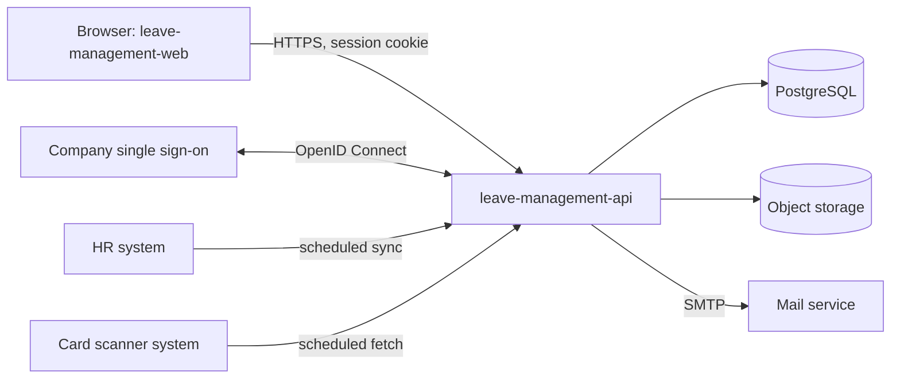

# Leave Request Management System — Technical Architecture

The BA delegated the technology choices. This baseline proposes them for review at GATE-09. The Spec Engine designs sequences and APIs against it.

## Technology Stack

| Layer | Choice | Why |
|---|---|---|
| Frontend | React 18, TypeScript, Vite | Mainstream, large hiring pool, fits a responsive web application |
| UI components | Ant Design 5 | Ready-made tables with filters, forms, date pickers and uploads, which is most of this product |
| Frontend data | TanStack Query, React Router | Server-state caching and routing without a global store |
| Backend | Java 21, Spring Boot 3 | Proven for enterprise systems; first-class single sign-on, scheduling and transactions |
| Persistence | PostgreSQL 16, Spring Data JPA, Flyway migrations | Relational data with strong consistency for request state changes |
| File storage | S3-compatible object storage | Supporting documents stay out of the database |
| Scheduled jobs | Spring scheduling with ShedLock | Each job runs once even with several application instances |
| Email | SMTP through a notification adapter, with an outbox table | The mail service is not chosen yet (Q-013); the adapter hides it |
| Sign-in | OpenID Connect against the company single sign-on (ASM-014) | Required by the BA; no passwords in this system |
| Runtime | Docker containers on Kubernetes (ASM-015) | Horizontal scaling for 33,000 users; several stateless instances |
| Observability | JSON logs, Micrometer metrics, OpenTelemetry traces | Standard with Spring Boot |

Load is modest for this stack: 33,000 users submitting a few requests a year each. The peak is the first working days of a month and the scheduled jobs, which process all employees.

## Application Architecture

One backend application, built as a **modular monolith**, and one single-page web application.



Backend modules. Each is a service in the services catalog, and the sequence diagrams use them as participants:

| Service | Owns | Responsibility |
|---|---|---|
| SVC-001 Leave Request Service | Leave requests, supporting documents, review decisions | Submission checks, request lifecycle, confirmation, approval, cancellation, month-end cancellation job |
| SVC-002 Leave Policy Service | Leave types, leave entitlements | Leave type rules, entitlement calculation, annual refresh job |
| SVC-003 Organisation Service | Copy of employees, organisational units, projects, public holidays | HR sync, signed-in user and roles, working-day calendar |
| SVC-004 Attendance Service | Copy of attendance records | Card scanner fetch, off-work days, weekly notification job |
| SVC-005 Notification Service | Email outbox | Builds and sends emails for the other services |
| SVC-006 Reporting Service | Nothing; reads only | Leave statistics by unit, department or company |

Rules between modules:

- A module exposes a Java interface; other modules call that interface, never its tables.
- One database, one schema per module. Foreign keys across schemas are allowed only towards Organisation Service data.
- A state change and the email it triggers are written in one transaction: the email goes to the outbox and SVC-005 sends it afterwards.

External data:

- **HR data is copied, not read on demand.** A scheduled sync loads employees, organisational units, projects and public holidays into read-only tables. The system keeps working when the HR system is unavailable. The interface and frequency are open (Q-015).
- **Card scanner data is fetched on a schedule** into a read-only table before the weekly notification runs. The interface is open (Q-012).
- Both sit behind an adapter interface, so the choice of API, file or database link changes one class.

Scheduled jobs:

| Job | Owner | When |
|---|---|---|
| HR data sync | SVC-003 | Frequency open (Q-015) |
| Card scanner fetch | SVC-004 | Before the weekly notification |
| Weekly attendance notification | SVC-004 | Every Friday |
| Month-end cancellation of unreviewed requests | SVC-001 | When a month ends |
| Annual entitlement refresh | SVC-002 | Start of each year |
| Email outbox dispatch | SVC-005 | Continuously |

Time: timestamps are stored in UTC. Leave dates are calendar dates without a time zone. Which time zone decides month and week boundaries is open (Q-019).

## Repository Structure

| Repository | Content |
|---|---|
| REPO-001 leave-management-api | Backend application |
| REPO-002 leave-management-web | Web application |

Backend layout, one package per module:

```text
src/main/java/com/company/leave/
  leaverequest/   api/  application/  domain/  infrastructure/
  leavepolicy/    api/  application/  domain/  infrastructure/
  organisation/   ...
  attendance/     ...
  notification/   ...
  reporting/      ...
  shared/         security, error handling, paging, audit
src/main/resources/db/migration/   Flyway scripts
```

- `api`: REST controllers and request/response DTOs.
- `application`: use-case services and transactions.
- `domain`: entities, value objects, business rules.
- `infrastructure`: repositories and external adapters.

Frontend layout:

```text
src/
  app/          routing, layout, providers
  features/     leave-requests/  reviews/  leave-types/  reports/
  shared/       api client, components, hooks, formatting
```

## API Conventions

General:

- REST over HTTPS, JSON bodies, base path `/api/v1`.
- Resource names are plural nouns in kebab-case: `/api/v1/leave-requests`, `/api/v1/leave-types`.
- JSON property names are camelCase. Enum values are UPPER_SNAKE_CASE, as in the data model.
- Identifiers created by this system are UUID strings. Identifiers from the HR system are kept as given.
- Dates are `YYYY-MM-DD`. Timestamps are ISO 8601 in UTC, for example `2026-01-31T17:00:00Z`.
- Every response carries an `X-Trace-Id` header.

Methods:

| Method | Use | Success |
|---|---|---|
| GET | Read one or list | 200 |
| POST on a collection | Create | 201 with a `Location` header and the created resource |
| PUT | Replace an editable resource | 200 with the resource |
| DELETE | Remove | 204 |
| POST on an action | State change | 200 with the updated resource |

State changes are action sub-resources, not field updates: `POST /api/v1/leave-requests/{id}/confirm`, `/deny`, `/approve`, `/reject`, `/cancel`, `/resubmit`.

Lists:

- Paging: `page` (first page is 1) and `size` (default 20, maximum 100).
- Sorting: `sort=field,asc` or `sort=field,desc`; repeat the parameter for several fields.
- Filtering: one query parameter per filter, for example `status=PENDING_APPROVAL&leaveTypeId=…&from=2026-01-01`.
- Response shape:

```json
{
  "items": [],
  "page": 1,
  "size": 20,
  "totalItems": 0,
  "totalPages": 0
}
```

Concurrency: every editable resource has a `version` number. An update or action sends the version it read; a stale version returns 409.

Several items in one call: all or nothing, in one transaction. If one item fails, nothing is changed and the error lists every failing item.

Files: upload with `multipart/form-data`; download through the API only, never by a direct storage link.

Current user: `GET /api/v1/me` returns the signed-in employee and their roles.

## Error Handling

Errors use the problem details format (RFC 9457) with media type `application/problem+json`:

```json
{
  "type": "https://leave.example/problems/validation",
  "title": "The request is not valid",
  "status": 400,
  "code": "VALIDATION_FAILED",
  "detail": "2 fields are not valid.",
  "traceId": "b7c1…",
  "errors": [
    { "field": "startDate", "code": "DATE_OUTSIDE_WINDOW", "message": "The start date must be in the future or in the current month." }
  ]
}
```

| Status | When |
|---|---|
| 400 | The request is malformed or a field fails validation. `errors` lists each field |
| 401 | Not signed in, or the session expired |
| 403 | Signed in, but the role does not allow the operation |
| 404 | The resource does not exist, or the user may not see it |
| 409 | The resource changed since it was read, or its state does not allow the action |
| 413 | An uploaded file is too large |
| 422 | The request is well-formed but breaks a business rule that blocks it |
| 500 | Unexpected error. The body carries only `traceId`; no internal detail |

- `code` is a stable UPPER_SNAKE_CASE string. The frontend maps codes to messages; it never parses `detail`.
- A request that exceeds the entitlement is **not** an error: it is accepted and flagged (BR-002).
- The frontend shows field errors next to the fields and in an error summary; other errors as a notification with the trace ID.

## Logging

- Structured JSON logs to standard output, collected by the platform.
- Every log line carries the trace ID, and the employee ID when a user is signed in.
- Levels: ERROR for failures needing action; WARN for rejected operations and retried integrations; INFO for state changes and job runs; DEBUG off in production.
- Each scheduled job logs its start, end, number of items processed and number failed.
- Never log personal data beyond the employee ID: no names, no gender, no document contents, no tokens.
- The audit trail is separate from logs and lives in the database; see the security rules.

## Testing Conventions

| Level | Tools | Scope |
|---|---|---|
| Backend unit | JUnit 5, AssertJ, Mockito | Domain rules and application services; every business rule has tests named after its ID |
| Backend integration | Spring Boot Test, Testcontainers (PostgreSQL) | Repositories, REST endpoints, security rules, scheduled jobs |
| Frontend unit | Vitest, React Testing Library | Components, forms and their validation |
| End to end | Playwright | One path per acceptance criterion marked as critical |

- Acceptance criteria from the use-case specification map to tests by their ID.
- External systems are replaced by stub adapters in tests.
- Tests that depend on the date use an injected clock; no test reads the system time.
- A pull request needs passing tests and at least 80 % line coverage on the domain and application packages.
