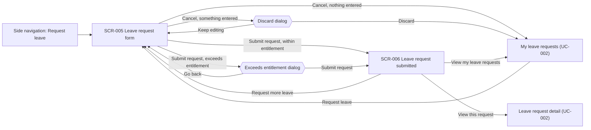

# UC-001 — Submit leave request: Functional UI

## Purpose

An employee (ACT-001) requests leave for themselves: a leave type, the dates, a day part, the Project Manager who confirms the request, and any documents the leave type requires.

- **Where they come from:** the side navigation item "Request leave", or the "My leave requests" list owned by UC-002.
- **What they do:** fill in one form (SCR-005). The form shows how many working days the request covers and how that compares with the entitlement. It blocks a request that breaks a blocking rule and explains how to fix it. It warns about a request that exceeds the entitlement and still lets the employee submit it.
- **Where they end up:** a confirmation page (SCR-006) that states the status of the new request and who reviews it next. From there they go to "My leave requests" or the request detail, both owned by UC-002.

A request is saved only when it is submitted. There is no draft.

## Screens

### SCR-005 — Leave request form

- **Route / entry point:** `/leave-requests/new` — reached from the side navigation item "Request leave", and from the "My leave requests" list (UC-002) where that list offers the action.
- **Purpose:** Enter and submit a new leave request.
- **Actors:** ACT-001 Employee. A Project Manager (ACT-002) uses the same form for their own leave.

#### Sections

1. **Page header** — title "Request leave" and the description "Leave is counted in working days. Weekends and public holidays are not counted."
2. **Error summary** — Alert (error) above the form, shown only after a submit attempt with errors. Lists each problem as a link to its field.
3. **Leave details** — Leave type (Select), Leave dates (Date range picker), Day part (Segmented control).
4. **Request summary** — Card shown once a leave type and dates are chosen: days requested, entitlement, already requested, remaining after this request. The figures are recalculated whenever the leave type, the dates or the day part change. The server recalculates them on submission, and its result is what counts.
5. **Reviewer** — one of three variants:
   - Project Manager (Select), for an employee who belongs to at least one project (BR-015);
   - Alert (information) instead of the field, for a user who is a Project Manager (BR-007);
   - Alert (information) instead of the field, for an employee who belongs to no project (BR-021).
   In all variants the Line Manager who approves the request is named below as read-only text.
6. **Supporting documents** — shown only when the chosen leave type requires documents (BR-005). One File upload per required document, labelled with the document's name. States the allowed types and size: "PDF, JPG or PNG, up to 10 MB."
7. **Exceeds entitlement warning** — Alert (warning) directly above the buttons, shown only when the request exceeds the entitlement (BR-002).
8. **Form actions** — Submit request (Primary) and Cancel (Default).
9. **Exceeds entitlement dialog** — Modal opened by Submit request when the form has no errors and the request exceeds the entitlement.
10. **Discard dialog** — Modal opened by Cancel when the employee has entered something.

Layout: single column, at most 640 px wide, labels above fields. On a phone (below 768 px) the Request summary Card sits between Leave details and Reviewer, buttons are 40 px high and take the full width, with Submit request first.

#### Fields

| Field | Control | Required | Source | Validation | Rule |
|---|---|---|---|---|---|
| Leave type | Select, searchable when more than 10 items | Yes | Options: `ENT-004.name` of every leave type. Eligibility: `ENT-004.gender_eligibility` compared with `ENT-002.gender`. Saved to `ENT-006.leave_type` | One leave type must be chosen. A leave type the employee is not eligible for is listed but disabled, with the reason under its name, for example "For female employees only". The server rejects an ineligible leave type | BR-004 |
| Leave dates | Date range picker | Yes | `ENT-006.start_date`, `ENT-006.end_date`. Non-working days: Saturdays, Sundays and `ENT-010.holiday_date` of the employee's country (`ENT-010.country`, `ENT-002.organisational_unit`) | Start and end date are both required; a single day is a range with the same start and end. The end date is not before the start date. The start date is on or after the first day of the current month: earlier days are disabled. There is no latest date. Weekends and public holidays are shown greyed with the holiday's name (`ENT-010.name`); they can lie inside the range but are not counted. The range must contain at least one working day | BR-001, BR-022 |
| Day part | Segmented control: All day, Morning, Afternoon | Yes, default All day | `ENT-006.day_part` | One option is always selected. Morning and Afternoon can be chosen only when the start and end date are the same day; for a longer range they are disabled and the value returns to All day (pending Q-026) | BR-017 |
| Project Manager | Select, searchable when more than 10 items | Yes, when shown | Options: `ENT-003.project_manager` of each project whose `ENT-003.members` include the employee, shown as `ENT-002.full_name` with `ENT-003.name`. Saved to `ENT-006.selected_project_manager` | One Project Manager from the list must be chosen. A Project Manager of several of the employee's projects appears once, with those project names. When the list has one item it is preselected. The field is not shown to a user who is a Project Manager (BR-007) or to an employee who belongs to no project (BR-021) | BR-015 |
| Required document, one field per entry of the leave type's required documents | File upload | Yes | Label: entry of `ENT-004.required_documents`. Saved to `ENT-007.file` and `ENT-007.document_type` | One file per required document (pending Q-029). Type PDF, JPG or PNG. At most 10 MB. No upload field exists when the leave type requires no document (pending Q-029) | BR-005; file type and size: security rules, Data Protection |
| Days requested | Read-only figure in Request summary | — | Calculated from `ENT-006.start_date`, `ENT-006.end_date`, `ENT-006.day_part` and `ENT-010.holiday_date` | Working days in the range, each counted as 1 day for All day or 0.5 day for Morning or Afternoon. Shown as days with halves, for example "2.5 days" | BR-022, BR-017 |
| Entitlement | Read-only figure in Request summary | — | `ENT-005.entitled_amount` for the employee, the chosen leave type and the year of the start date (`ENT-005.year`) | The year is the year of the start date (pending Q-027). When the employee has no entitlement for that leave type and year, the text "No entitlement on record" is shown and the amount counts as 0 days (pending Q-016, Q-022) | BR-003 |
| Already requested | Read-only figure in Request summary | — | Sum of the days of the employee's other requests (`ENT-006`) for the same leave type and year | Counts requests with status Pending confirmation, Pending approval or Approved; not Denied, Rejected or Cancelled (pending Q-027) | BR-002 |
| Remaining after this request | Read-only figure in Request summary | — | Entitlement minus Already requested minus Days requested | When below 0 it is shown as "Exceeds by N days" with a warning icon and the text colour Warning, and the Exceeds entitlement warning appears | BR-002 |
| Line Manager | Read-only text in Reviewer | — | `ENT-002.line_manager`, shown as `ENT-002.full_name` | None. Text: "Approved by: {Line Manager name}" | BR-021, REQ-003 |

The form has no field for the employee: a request is always for the signed-in user (`ENT-006.employee`).

#### Actions

| Action | Enabled when | Result | Rule |
|---|---|---|---|
| Choose or change the leave type | Always | Request summary shows the entitlement for that leave type. Supporting documents shows the upload fields of that leave type. Files already uploaded for a document the new leave type does not require are removed, and a message says so | BR-005, BR-003 |
| Choose or change the dates or the day part | Always | Days requested, Remaining after this request and the Exceeds entitlement warning are recalculated | BR-022, BR-017, BR-002 |
| Add a file | The upload field has no file | The file is checked for type and size. An accepted file is listed with its name and size. A refused file is listed with its error and does not count as uploaded | BR-005 |
| Remove a file (Link button on the file row) | A file is listed | The file is removed from the request; the upload field is empty again | BR-005 |
| Submit request (Primary) | Always, except while a submission is running: then it is disabled and shows a loading indicator | 1. The whole form is validated. 2. With errors: the Error summary appears, focus moves to it, and each message is shown under its field. Nothing is saved. 3. Without errors and within the entitlement: the request is created and SCR-006 opens. 4. Without errors and exceeding the entitlement: the Exceeds entitlement dialog opens | BR-001, BR-004, BR-005, BR-015, BR-002 |
| Exceeds entitlement dialog: Submit request (Primary) | Always, except while the submission is running | The request is created, flagged as exceeding the entitlement (`ENT-006.exceeds_entitlement`), and SCR-006 opens | BR-002 |
| Exceeds entitlement dialog: Go back (Default) | Always | The dialog closes. The form keeps its values. Nothing is saved | BR-002 |
| Cancel (Default) | Always | Nothing entered: opens "My leave requests" (UC-002). Something entered: the Discard dialog opens | — |
| Discard dialog: Discard (Danger) | Always | Opens "My leave requests" (UC-002). Nothing is saved | — |
| Discard dialog: Keep editing (Default) | Always | The dialog closes. The form keeps its values | — |
| Retry, in the load error Alert | The form could not be loaded | Loads the form again | — |

What a successful submission does, as far as the employee can see it:

| Who submits | Status of the new request | Who is emailed | Rule |
|---|---|---|---|
| Employee who chose a Project Manager | Pending confirmation | The chosen Project Manager | BR-015, BR-018 |
| User who is a Project Manager | Pending approval; the confirmation is recorded as automatic (`ENT-008.auto_confirmed`) | The Line Manager (ASM-012) | BR-007 |
| Employee who belongs to no project | Pending approval; there is no confirmation step | The Line Manager (ASM-012) | BR-021 |

If the server finds on submission that the request exceeds the entitlement although the form did not warn (for example because another request was submitted in the meantime), the request is still accepted and flagged, and SCR-006 shows the warning (BR-002).

#### Table columns

None. This screen has no list.

#### States

| State | What the user sees |
|---|---|
| Loading | Skeleton in the shape of the form while the leave types, the employee's Project Managers, Line Manager and working-day calendar load |
| Empty | No leave type exists yet: an Empty state replaces the form with the sentence "No leave types are available yet. Ask Admin/HR to set them up." |
| Initial | The form with no leave type and no dates, Day part on All day, the Reviewer section in the variant that fits the user, no Request summary and no Supporting documents section |
| Populated | Leave type and dates chosen: Request summary with its four figures; Supporting documents when the leave type requires any |
| Exceeds entitlement | Populated, plus "Exceeds by N days" in the Request summary and the Alert (warning) above the buttons. Submit request stays enabled |
| Validation error | Error summary above the form with one link per problem and focus on it; each message under its field; the field border in the error colour. The values and files entered are kept |
| Submitting | Submit request disabled with a loading indicator; the fields cannot be changed until the server answers |
| Server error | Loading failed: an Alert (error) with a Retry button and the trace ID replaces the form. Submission failed: an Alert (error) with the trace ID above the form; the values and files are kept and Submit request is enabled again. Nothing was saved |
| Session expired | The user is sent to the company single sign-on. What was entered is lost |
| No access | For a user who may not request leave: the No access page with a link home |
| Success | SCR-006 opens with a Notification "Leave request submitted." |

#### Messages

| Trigger | Message text | Type | Rule |
|---|---|---|---|
| Submit attempt with errors | "This request cannot be submitted yet. Fix the following:" followed by one link per problem | Error summary (Alert, error) | BR-001, BR-004, BR-005 |
| No leave type chosen | "Choose a leave type." | Field error | REQ-001 |
| Ineligible leave type, shown on the disabled option | "{Eligibility of the leave type}, for example: For female employees only." | Help text on the option | BR-004 |
| Server rejects the leave type as ineligible | "You are not eligible for {leave type}. Choose another leave type." | Field error | BR-004 |
| No dates chosen | "Choose the first and the last day of your leave." | Field error | BR-001 |
| Start date before the first day of the current month | "Choose a start date in the future or in the current month." | Field error | BR-001 |
| No working day in the range | "These dates contain no working day. Choose dates that include at least one working day." | Field error | BR-022 |
| Range longer than one day | "Morning and Afternoon are available for a single day only." | Help text under Day part | BR-017 (pending Q-026) |
| No Project Manager chosen | "Choose the Project Manager who will confirm this request." | Field error | BR-015 |
| Server rejects the chosen Project Manager | "{Name} is not a Project Manager of one of your projects. Choose another Project Manager." | Field error | BR-015 |
| User is a Project Manager | "You are a Project Manager, so your request is confirmed automatically. It goes straight to your Line Manager for approval." | Alert (information) in Reviewer | BR-007 |
| Employee belongs to no project | "You are not in a project, so your request needs no confirmation. It goes straight to your Line Manager for approval." | Alert (information) in Reviewer | BR-021 |
| Required document missing | "Upload {document name}. {Leave type} requires it." | Field error | BR-005 |
| File of another type | "{File name} is not a PDF, JPG or PNG file. Upload a PDF, JPG or PNG file." | Upload error on the file row | BR-005; security rules |
| File larger than 10 MB | "{File name} is larger than 10 MB. Upload a smaller file." | Upload error on the file row | BR-005; security rules |
| File could not be uploaded or was refused by the server | "{File name} could not be uploaded. Try again or upload a different file." | Upload error on the file row | BR-005; security rules |
| Leave type changed and uploaded files are no longer required | "The required documents changed with the leave type. Files that are no longer needed were removed." | Alert (information) in Supporting documents | BR-005 |
| No entitlement for the leave type and year | "No entitlement on record for {leave type} in {year}." | Text in Request summary | BR-003 (pending Q-016) |
| Request exceeds the entitlement | "This request exceeds your {leave type} entitlement by {N} days. You can still submit it. It will be flagged for manual review." | Alert (warning) above the buttons | BR-002 |
| Submit request on a request that exceeds the entitlement | Title: "Submit a request that exceeds your entitlement?" Text: "You are requesting {N} days of {leave type} and have {M} days left for {year}. The request will be flagged as Exceeds entitlement for the people who review it." Buttons: "Submit request", "Go back" | Modal | BR-002 |
| Cancel after something was entered | Title: "Discard this request?" Text: "What you entered will not be saved." Buttons: "Discard", "Keep editing" | Modal | — |
| Form could not be loaded | "We could not load the leave request form. Try again. Trace ID: {trace ID}" | Alert (error) with Retry | — |
| Submission failed on the server | "We could not submit your request and nothing was saved. Try again. Trace ID: {trace ID}" | Alert (error) above the form | — |
| Session expired | "Your session has expired. Sign in again." | Notification before the redirect to single sign-on | — |

### SCR-006 — Leave request submitted

- **Route / entry point:** `/leave-requests/:requestId/submitted` — opened by SCR-005 after a successful submission. It reads the request, so reloading the page shows it again.
- **Purpose:** Confirm the submission: what was requested, the status, whether it is flagged, who reviews it next and by when.
- **Actors:** ACT-001 Employee, for their own request only.

#### Sections

1. **Page header** — title "Leave request submitted".
2. **Outcome** — Alert (success) with the sentence that fits the route the request took (see Messages).
3. **Exceeds entitlement notice** — Alert (warning), shown only when the request is flagged (BR-002).
4. **Request summary** — Descriptions list with the fields below. The status is a Status tag; a flagged request also carries the Warning tag "Exceeds entitlement".
5. **What happens next** — short text: who decides next, the review deadline and that the employee is emailed about the decision.
6. **Page actions** — View my leave requests (Primary), View this request (Default), Request more leave (Default).

On a phone the Descriptions list is one column, with each label above its value, and the buttons take the full width.

#### Fields

All fields are read-only.

| Field | Control | Required | Source | Validation | Rule |
|---|---|---|---|---|---|
| Leave type | Descriptions list item | — | `ENT-006.leave_type`, shown as `ENT-004.name` | None | REQ-001 |
| Dates | Descriptions list item | — | `ENT-006.start_date`, `ENT-006.end_date`, `ENT-006.day_part` | None. Format: "5 – 9 Jan 2026, All day" or "5 Jan 2026, Morning" | BR-017 |
| Days requested | Descriptions list item | — | Calculated as on SCR-005 from `ENT-006.start_date`, `ENT-006.end_date`, `ENT-006.day_part` and `ENT-010.holiday_date` | None. Format: "2.5 days" | BR-022, BR-017 |
| Status | Status tag | — | `ENT-006.status` | None. Pending confirmation or Pending approval (labels per ASM-005) | BR-007, BR-021 |
| Exceeds entitlement | Warning tag next to the status | — | `ENT-006.exceeds_entitlement` | Shown only when true | BR-002 |
| Project Manager | Descriptions list item | — | `ENT-006.selected_project_manager`, shown as `ENT-002.full_name` | Shown only when a Project Manager was chosen | BR-015 |
| Line Manager | Descriptions list item | — | `ENT-002.line_manager`, shown as `ENT-002.full_name` | None | REQ-003 |
| Documents | Descriptions list item | — | `ENT-007.document_type` and the file name of `ENT-007.file` | Shown only when the request has documents. Names only; documents are opened from the request detail (UC-002) | BR-005 |
| Submitted | Descriptions list item | — | `ENT-006.submitted_at` | None. Format: "30 Sep 2026, 14:05" | REQ-001 |
| Review deadline | Text in What happens next | — | Last day of the calendar month of `ENT-006.start_date` | None. Format: "31 Jan 2026" | BR-008 |

#### Actions

| Action | Enabled when | Result | Rule |
|---|---|---|---|
| View my leave requests (Primary) | Always | Opens the "My leave requests" list (UC-002) | — |
| View this request (Default) | Always | Opens the detail of this request (UC-002) | — |
| Request more leave (Default) | Always | Opens SCR-005 with an empty form | — |
| Retry, in the error Alert | The page could not be loaded | Loads the page again | — |

#### Table columns

None. This screen has no list.

#### States

| State | What the user sees |
|---|---|
| Loading | Skeleton in the shape of the Descriptions list |
| Empty | The request does not exist or is not the user's own: a page with the sentence "We could not find this leave request." and a link to "My leave requests" (UC-002) |
| Populated | Outcome, Request summary, What happens next and the page actions. Opened again later, the Status tag shows the request's current status |
| Validation error | Does not occur: the screen has no input |
| Server error | Alert (error) with a Retry button and the trace ID in place of the content. The request itself was already saved |
| Success | The page itself, plus the Notification "Leave request submitted." when it opens from SCR-005 |

#### Messages

| Trigger | Message text | Type | Rule |
|---|---|---|---|
| Page opens from SCR-005 | "Leave request submitted." | Notification (success) | REQ-001 |
| Request is Pending confirmation | "Your request was submitted. {Project Manager name} has been notified by email and will confirm or deny it." | Alert (success) in Outcome | BR-015, BR-018 |
| Request of a Project Manager, confirmed automatically | "Your request was submitted and confirmed automatically because you are a Project Manager. {Line Manager name} has been notified by email and will approve or reject it." | Alert (success) in Outcome | BR-007; email per ASM-012 |
| Request of an employee who belongs to no project | "Your request was submitted. You are not in a project, so it needs no confirmation. {Line Manager name} has been notified by email and will approve or reject it." | Alert (success) in Outcome | BR-021; email per ASM-012 |
| Request is flagged | "This request exceeds your {leave type} entitlement by {N} days. It is flagged for manual review." | Alert (warning) | BR-002 |
| Request is Pending confirmation | "After the confirmation, {Line Manager name} approves or rejects your request." | Text in What happens next | REQ-003 |
| Always | "Your request must be decided by {review deadline}. If it is still undecided then, it is cancelled automatically." | Text in What happens next | BR-008 |
| Always | "You will get an email when your request is denied, approved or rejected." | Text in What happens next | BR-018 |
| Request not found or not the user's own | "We could not find this leave request." | Page message with a link to "My leave requests" | REQ-008 |
| Page could not be loaded | "We could not load your request. It was submitted. Try again. Trace ID: {trace ID}" | Alert (error) with Retry | — |

## Navigation

"My leave requests" and the leave request detail belong to UC-002 and are navigation targets only. Both dialogs are sections of SCR-005.

## Permissions

| Actor / role | Can see | Can do | Rule |
|---|---|---|---|
| ACT-001 Employee (role EMPLOYEE) | "Request leave" in the side navigation. SCR-005 with their own entitlement, the Project Managers of their own projects and their own Line Manager. SCR-006 for their own requests only | Submit a leave request for themselves. Nobody submits for another employee | REQ-008, BR-015 |
| ACT-002 Project Manager (role PROJECT_MANAGER), requesting their own leave | The same screens. The Project Manager field is replaced by the automatic confirmation message | Submit a leave request for themselves; it is confirmed automatically | BR-007 |
| ACT-003 Line Manager (role LINE_MANAGER) | Neither screen. "Request leave" is not in their side navigation; the route shows the No access page | Nothing | BR-019 |
| ACT-004 Admin/HR (role ADMIN_HR) | Nothing through this role. The role gives no right to submit a request, for themselves or for others | Nothing through this role | REQ-008 |

Hiding is a convenience: the server checks every submission and every read of SCR-006 (security rules, Authorization). A request outside the user's scope is answered as not found.

## Open Questions

Raised by this design:

- Q-026 — How does the day part apply to a request that spans several days? **Assumed until answered:** Morning and Afternoon can be chosen for a single day only; a range of several days is All day.
- Q-027 — Which of the employee's other requests count as already used when the entitlement is checked, and which year's entitlement applies to a request that spans two years? **Assumed until answered:** requests that are Pending confirmation, Pending approval or Approved count; the whole request is counted against the year of its start date.
- Q-028 — Can an employee submit a request that overlaps another of their own pending or approved requests? **Assumed until answered:** the form does not check for overlaps and shows no message about them.
- Q-029 — How many files can be uploaded for one required document, and can documents be attached when the leave type requires none? **Assumed until answered:** exactly one file per required document, and no upload field when none is required.

Already open and affecting these screens:

- Q-016 — Entitlement of an employee who joins during the year. **Assumed until answered:** the Request summary says "No entitlement on record", the amount counts as 0 days, and the request can be submitted with the Exceeds entitlement warning.
- Q-019 — Time zone that decides the current month. **Assumed until answered:** the form does not work out the current month itself; the earliest date that can be chosen and the review deadline come from the server, so the answer does not change the screens.
- Q-022 — Whether a leave type such as Unpaid Leave has no entitlement limit. **Assumed until answered:** every leave type is checked against its entitlement.

Assumptions used:

- ASM-005 — the status labels Pending confirmation and Pending approval.
- ASM-012 — the Line Manager is emailed when a request skips confirmation.
- ASM-013 — weekends are Saturday and Sunday in every country.
