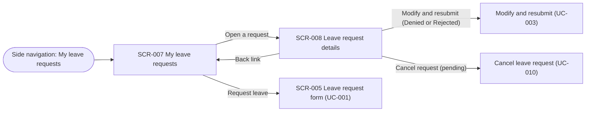

# UC-002 — View my leave requests: Functional UI

## Purpose

An employee checks what leave they have requested and where each request stands.

- **Comes from:** the side navigation item "My leave requests".
- **Does here:** scans the list of their own requests (SCR-007), narrows it with filters, and opens one request to see its details, what happens next and its review history (SCR-008).
- **Ends up:** informed about the status of each request. From here the employee can continue to a new request (UC-001), to modifying and resubmitting a denied or rejected request (UC-003) or to cancelling a pending request (UC-010). Those use cases design their own screens; UC-002 only shows the entry points.

Both screens are read-only: UC-002 changes no data. An employee sees their own requests only (BR-014).

## Screens

### SCR-007 — My leave requests

- **Route / entry point:** `/leave-requests` — reached from the side navigation item "My leave requests", and from the back link of SCR-008. Filters, sort order, page and page size are kept in the URL.
- **Purpose:** The employee sees all of their own leave requests with the current status of each, and opens one.
- **Actors:** ACT-001. A Project Manager uses this screen as an employee, for their own requests.

#### Sections

1. Page header — title "My leave requests" and the primary Button "Request leave" on the right.
2. Filter bar — Leave type, Status and Leave dates, with Apply and Reset, and the number of matching requests ("12 requests"). On a phone the fields sit behind a Filters button.
3. Requests — Table with one row per leave request. On a phone each row becomes a Card: leave type and leave dates as the title, the Status tag at the top right, day part, working days and submitted date below.
4. Pagination — page numbers and a page size of 20 (default), 50 or 100.

The default view has no filter set and shows the employee's requests of every status, the latest leave dates first. The employee has no queue of work here, so nothing is hidden by default; the default of BR-013 applies to the reviewer dashboards only.

#### Fields

All fields are filters. None is required.

| Field | Control | Required | Source | Validation | Rule |
|---|---|---|---|---|---|
| Leave type | Select, one value, first option "All leave types" | No | Options: ENT-004.name. Filters on ENT-006.leave_type | None | — |
| Status | Select, several values, empty means all statuses | No | ENT-006.status, with the labels of the design system's Status tag mapping (ASM-005) | None | — |
| Leave dates | Date range picker | No | ENT-006.start_date, ENT-006.end_date. Matches requests whose leave dates overlap the chosen range | The end date cannot be before the start date; the picker disables those days | — |

There is no employee name filter: the list only ever holds the signed-in employee's own requests (BR-014).

#### Actions

| Action | Enabled when | Result | Rule |
|---|---|---|---|
| Request leave (primary Button) | Always | Opens SCR-005 Leave request form, owned by UC-001 | — |
| Apply | Always | Reloads the table with the chosen filters, returns to page 1 and writes the filters to the URL | BR-014 |
| Reset | At least one filter is set | Clears the filters and returns to the default view | — |
| Sort (column header) | On the sortable columns | Reloads the table in that order, ascending then descending, and returns to page 1 | — |
| Open a request (row, "View" Link in the action column, or the whole Card on a phone) | Always | Opens SCR-008 for that request | BR-014 |
| Change page or page size | The list has more than one page, or more than 20 requests | Shows that page; the choice is written to the URL | — |
| Retry | Server error state | Loads the list again with the same filters | — |

Resubmitting and cancelling are not offered on the list. Their entry points are on SCR-008.

#### Table columns

| Column | Source | Sortable | Notes |
|---|---|---|---|
| Leave type | ENT-006.leave_type → ENT-004.name | No | |
| Leave dates | ENT-006.start_date, ENT-006.end_date | Yes, by start date | `5 – 9 Jan 2026`; one day as `5 Jan 2026`. Default sort: latest start date first |
| Day part | ENT-006.day_part | No | "All day", "Morning" or "Afternoon" (BR-017). Shown as the one value stored on the request, pending Q-026 |
| Working days | Derived from ENT-006.start_date, ENT-006.end_date and ENT-006.day_part | No | `2.5 days`. The working days requested, in half days, without weekends and public holidays (BR-017, BR-022). It is the same figure the request form shows under UC-001; UC-002 defines no counting rule of its own. Pending Q-026 |
| Status | ENT-006.status, ENT-006.exceeds_entitlement | No | Status tag. A second Warning tag "Exceeds entitlement" when ENT-006.exceeds_entitlement is true (BR-002). Labels are proposed (ASM-005) |
| Submitted | ENT-006.submitted_at | Yes | `5 Jan 2026` |
| (action) | — | No | Link "View" |

#### States

| State | What the user sees |
|---|---|
| Loading | Page header and Filter bar, and a Skeleton in the shape of the table rows (of Cards on a phone) |
| Empty | No request at all: Empty state "You have no leave requests yet." with the Button "Request leave". No request matches the filters: Empty state "No leave requests match these filters." with the Link "Reset filters" |
| Populated | The table, the number of matching requests and the pagination |
| Validation error | Not applicable: the only inputs are filters, and the Date range picker does not allow an end date before the start date. A filter value in the URL that is not valid is ignored |
| Server error | Page header and Filter bar stay. In place of the table: Alert (error) with the message below, a Retry Button and the trace ID |
| Success | Not applicable: the screen changes no data. Notifications after submitting, resubmitting or cancelling belong to UC-001, UC-003 and UC-010 |
| No access | For a signed-in user without the Employee role: the No access page, with a link home (BR-014) |

#### Messages

| Trigger | Message text | Type | Rule |
|---|---|---|---|
| The employee has no leave request | "You have no leave requests yet." with the Button "Request leave" | Empty state | — |
| No request matches the filters | "No leave requests match these filters." with the Link "Reset filters" | Empty state | — |
| The list is shown | "{n} requests" (or "1 request") | Text in the Filter bar | — |
| The list cannot be loaded | "Your leave requests could not be loaded. Try again. Trace ID: {trace ID}" | Alert (error) with Retry | — |
| A user without the Employee role opens the route | "Your role cannot open this area." with a link home | No access page | BR-014 |

### SCR-008 — Leave request details

- **Route / entry point:** `/leave-requests/:requestId` — reached by opening a request on SCR-007. The page has its own URL, so a link can open it directly.
- **Purpose:** Shows the employee one of their own leave requests, read-only: what was requested, its current status, what happens next and its review history. Carries the entry points to modify and resubmit (UC-003) and to cancel (UC-010).
- **Actors:** ACT-001. A Project Manager uses this screen as an employee, for their own requests.

#### Sections

1. Page header — back Link "My leave requests"; title made of the leave type and the leave dates, for example "Paid Leave, 5 – 9 Jan 2026"; the Status tag and, when the request is flagged, the Warning tag "Exceeds entitlement"; on the right at most one action Button (see Actions). On a phone the Button sits below the title at full width.
2. Status message — one Alert that says where the request stands and what happens next (see Messages). While the request is pending and flagged, a second Alert (warning) about the entitlement.
3. Request details — Descriptions list with the fields below. One column on a phone.
4. History — Timeline of the request, oldest event first (see Timeline events).

Not shown, pending an answer:

- The supporting documents uploaded with the request (pending Q-030). UC-002 does not read them.
- A reason or comment from the reviewer (pending Q-024). The Review Decision holds none today.

#### Fields

All fields are read-only items of the Descriptions list or of the page header.

| Field | Control | Required | Source | Validation | Rule |
|---|---|---|---|---|---|
| Status | Status tag (page header) | — | ENT-006.status, labels per the design system's mapping (ASM-005) | None | — |
| Exceeds entitlement | Warning tag (page header), shown only when true | — | ENT-006.exceeds_entitlement | None | BR-002 |
| Leave type | Read-only text | — | ENT-006.leave_type → ENT-004.name | None | — |
| Leave dates | Read-only text, `5 – 9 Jan 2026` | — | ENT-006.start_date, ENT-006.end_date | None | — |
| Day part | Read-only text: "All day", "Morning" or "Afternoon" | — | ENT-006.day_part | None | BR-017; pending Q-026 |
| Working days | Read-only text, `2.5 days` | — | Derived from ENT-006.start_date, ENT-006.end_date and ENT-006.day_part; the same figure as on SCR-007 | None | BR-017, BR-022; pending Q-026 |
| Project Manager | Read-only text: the full name. When the request has no selected Project Manager: "No confirmation needed" | — | ENT-006.selected_project_manager → ENT-002.full_name | None | BR-006, BR-021 |
| Submitted | Read-only text, `5 Jan 2026, 14:30` | — | ENT-006.submitted_at | None | — |

#### Timeline events

The Timeline lists what happened to the request, each event with its date and time (`5 Jan 2026, 14:30`). It shows every Review Decision the request holds. While the request is pending, the last item is the step it is waiting for, shown as not yet done.

| Event | Shown when | Text | Source | Rule |
|---|---|---|---|---|
| Submitted | Always, first item | "Submitted" | ENT-006.submitted_at | — |
| Confirmed | A decision of step CONFIRMATION with outcome CONFIRMED, not automatic | "Confirmed by {full name}" | ENT-008.step, ENT-008.outcome, ENT-008.decided_by → ENT-002.full_name, ENT-008.decided_at | BR-006 |
| Confirmed automatically | A decision with ENT-008.auto_confirmed true | "Confirmed automatically: you are a Project Manager" | ENT-008.auto_confirmed, ENT-008.decided_at | BR-007 |
| Denied | A decision with outcome DENIED | "Denied by {full name}" | ENT-008.outcome, ENT-008.decided_by → ENT-002.full_name, ENT-008.decided_at | BR-006 |
| Approved | A decision with outcome APPROVED | "Approved by {full name}" | ENT-008.outcome, ENT-008.decided_by → ENT-002.full_name, ENT-008.decided_at | BR-006 |
| Rejected | A decision with outcome REJECTED | "Rejected by {full name}" | ENT-008.outcome, ENT-008.decided_by → ENT-002.full_name, ENT-008.decided_at | BR-006 |
| Cancelled by the employee | Status CANCELLED with reason BY_EMPLOYEE | "Cancelled by you" | ENT-006.cancellation_reason, ENT-006.cancelled_at | BR-016 |
| Cancelled automatically | Status CANCELLED with reason REVIEW_DEADLINE_PASSED | "Cancelled automatically: not approved by the end of {month and year of the start date}" | ENT-006.cancellation_reason, ENT-006.cancelled_at, ENT-006.start_date | BR-008 |
| Waiting for confirmation | Status PENDING_CONFIRMATION, last item | "Waiting for confirmation by {Project Manager's full name}" | ENT-006.status, ENT-006.selected_project_manager → ENT-002.full_name | BR-006 |
| Waiting for approval | Status PENDING_APPROVAL, last item | "Waiting for approval by your Line Manager" | ENT-006.status | BR-006 |

- A request from an employee who belongs to no project has no confirmation event: the Timeline goes from "Submitted" to "Waiting for approval" (BR-021).
- A request that was denied or rejected and then resubmitted keeps its earlier decisions in the Timeline, because they are Review Decisions of the same request. How the resubmission itself is recorded and shown belongs to UC-003.

#### Actions

| Action | Enabled when | Result | Rule |
|---|---|---|---|
| My leave requests (back Link) | Always | Returns to SCR-007 with the filters, sort order and page the employee left | — |
| Modify and resubmit (primary Button) | Status is DENIED or REJECTED. Hidden in every other status | Entry point to UC-003, which designs what follows | BR-009 |
| Cancel request (Danger Button) | Status is PENDING_CONFIRMATION or PENDING_APPROVAL. Hidden in every other status | Entry point to UC-010, which designs the confirmation Modal and the result | BR-016 |
| Retry | Server error state | Loads the request again | — |

At most one of the two entry points is visible at a time. An APPROVED or CANCELLED request has no action Button.

#### States

| State | What the user sees |
|---|---|
| Loading | Skeleton in the shape of the page header, the Descriptions list and the Timeline |
| Empty | Not found: the request does not exist or is not one of the employee's own. Both cases look the same: the message below and the Link "Back to my leave requests" (BR-014) |
| Populated | Page header, status message, request details and history. The status message and the action Button depend on the status (see Messages and Actions) |
| Validation error | Not applicable: the screen has no input |
| Server error | Alert (error) with the message below, a Retry Button and the trace ID |
| Success | Not applicable: the screen changes no data |
| No access | For a signed-in user without the Employee role: the No access page, with a link home (BR-014) |

#### Messages

The deadline date in these messages is the last day of the calendar month of ENT-006.start_date.

| Trigger | Message text | Type | Rule |
|---|---|---|---|
| Status PENDING_CONFIRMATION | "Waiting for confirmation by {Project Manager's full name}. If this request is not confirmed and approved by {deadline date}, it is cancelled automatically." | Alert (info) | BR-006, BR-008 |
| Status PENDING_APPROVAL | "Waiting for approval by your Line Manager. If this request is not approved by {deadline date}, it is cancelled automatically." | Alert (info) | BR-006, BR-008 |
| Status PENDING_CONFIRMATION or PENDING_APPROVAL, and ENT-006.exceeds_entitlement is true | "This request exceeds your entitlement. Your reviewers check it manually." | Alert (warning), below the status message | BR-002 |
| Status DENIED | "{Full name of the Project Manager who denied it} denied this request on {date}. You can modify it and submit it again." | Alert (error) | BR-006, BR-009 |
| Status REJECTED | "{Full name of the Line Manager who rejected it} rejected this request on {date}. You can modify it and submit it again." | Alert (error) | BR-006, BR-009 |
| Status APPROVED | "This request is approved. An approved request cannot be cancelled." | Alert (success) | BR-016 |
| Status CANCELLED, reason BY_EMPLOYEE | "You cancelled this request on {date}." | Alert (info) | BR-016 |
| Status CANCELLED, reason REVIEW_DEADLINE_PASSED | "This request was cancelled automatically because it was not approved by {deadline date}." | Alert (info) | BR-008 |
| The request does not exist or belongs to someone else | "This leave request cannot be found. Check the link, or go back to your leave requests." with the Link "Back to my leave requests" | Empty state | BR-014 |
| The request cannot be loaded | "This leave request could not be loaded. Try again. Trace ID: {trace ID}" | Alert (error) with Retry | — |
| A user without the Employee role opens the route | "Your role cannot open this area." with a link home | No access page | BR-014 |

## Navigation

SCR-005 is owned by UC-001. The targets of "Modify and resubmit" and "Cancel request" are designed in UC-003 and UC-010; UC-002 defines only where their entry points are and when they are visible.

## Permissions

| Actor / role | Can see | Can do | Rule |
|---|---|---|---|
| Employee (ACT-001) | Their own leave requests only, on SCR-007 and SCR-008: request data, status, the Exceeds entitlement flag and the review history with the reviewers' names | Filter, sort and page the list; open a request; use the entry points "Request leave", "Modify and resubmit" and "Cancel request" when they are visible | BR-014 |
| Project Manager (ACT-002), as an employee | The same, for their own requests. Their confirmation step shows as "Confirmed automatically" | The same | BR-014, BR-007 |
| Project Manager (ACT-002), Line Manager (ACT-003) and Admin/HR (ACT-004), as reviewers or administrators | Nothing of other employees' requests on these screens. Reviewers see the requests they review in their own areas (UC-004, UC-005) | Nothing on these screens. Opening another employee's request through SCR-008 shows "This leave request cannot be found" | BR-014 |
| Line Manager (ACT-003) | A Line Manager submits no leave requests, so has no requests to see here | Nothing | BR-019 |
| Any signed-in user without the Employee role | The No access page. "My leave requests" is not in their side navigation | Nothing | BR-014 |

The server enforces these rules on every request; hiding a navigation item or a Button is only a convenience.

## Open Questions

- Q-030 — Does the employee see, and can they download, the supporting documents of their own request on the read-only details? Assumed until answered: SCR-008 has no documents section, because UC-002 does not read supporting documents. Showing them would add that entity to the use case in the overview.
- Q-024 — Does a reviewer give a reason when denying or rejecting, and does the employee see it? Assumed until answered: SCR-008 shows who decided and when, in the status message and the Timeline, and no reason or comment.
- Q-026 — How does the day part apply to a request that spans several days? Assumed until answered: "Day part" shows the one value stored on the request, and "Working days" shows the figure counted under UC-001. If the answer adds a second day part, the Day part column and field change.

## Assumptions

- ASM-005 — The status names are proposed labels. The screens use the labels of the design system's Status tag mapping: Pending confirmation, Pending approval, Approved, Denied, Rejected, Cancelled.
