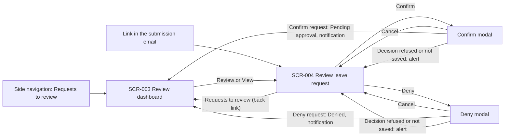

# UC-004 — Confirm or deny leave request: Functional UI

## Purpose

A Project Manager (ACT-002) confirms or denies the leave requests of the team members who selected them as the confirming Project Manager (BR-015). This is review step 1 of the two-step review (BR-006).

- **Where they come from:** the side navigation item "Requests to review", or the link in the email they receive when an employee submits a request (BR-018).
- **What they do:** find the requests that wait for them on the review dashboard (SCR-003), open one (SCR-004), check its details and supporting documents, and confirm or deny it before the end of the month of the leave start date (BR-008).
- **Where they end up:** back on the dashboard with a notification. A confirmed request is Pending approval and its Line Manager is emailed. A denied request is Denied and the employee is emailed (BR-018).

Both screens are written around "the reviewer" so that UC-005 can extend them for the Line Manager. This document specifies the Project Manager's behaviour only.

## Screens

### SCR-003 — Review dashboard

- **Route / entry point:** `/reviews` — reached from the side navigation item "Requests to review", and after every decision made on SCR-004. The chosen tab, filters, sort order and page are kept in the URL, so a filtered list can be bookmarked.
- **Purpose:** show the Project Manager the requests that need their confirmation, let them find any request that selected them, and open a request for review.
- **Actors:** ACT-002

#### Sections

1. **Page header** — title "Requests to review" and the description "Leave requests that selected you as the confirming Project Manager." The page has no primary button: the primary action is the Review link of each row.
2. **Tabs** — "Needs my action" (default) and "All requests".
   - Needs my action: requests in status Pending confirmation whose selected Project Manager is the signed-in user (BR-013). The tab label carries the number of such requests, for example "Needs my action (5)", whatever filters are set.
   - All requests: every request whose selected Project Manager is the signed-in user, in any status (BR-014).
3. **Filter bar** — Leave type, Employee name, Leave dates and Status, with Apply and Reset and the number of matching requests, for example "12 requests". The Status filter is shown on the All requests tab only; on Needs my action every request is Pending confirmation.
4. **Requests table** — one row per request; see Table columns.
5. **Pagination** — below the table; page size 20 (default), 50 or 100.

Responsive behaviour (design system, Layout): below 768 px each row becomes a Card with the employee name as its title, the status tag at the top right, the leave type, leave dates, days and "Confirm by" below, and the Review link at the bottom. The filter fields sit behind a Filters button that shows how many filters are set.

#### Fields

| Field | Control | Required | Source | Validation | Rule |
|---|---|---|---|---|---|
| Leave type | Select, single choice, first option "All leave types"; searchable when more than 10 leave types | No | Options: ENT-004.name. Filters on ENT-006.leave_type | The value must be an existing leave type; an unknown value from the URL is ignored | BR-013; meaning of "request type" pending Q-025 |
| Employee name | Text input with a clear button | No | ENT-002.full_name of ENT-006.employee | Spaces at both ends are removed. Matches any part of the name, ignoring upper and lower case | BR-013 |
| Leave dates | Date range picker, placeholder "From – To" | No | ENT-006.start_date, ENT-006.end_date | Both dates are chosen together; the end date cannot be before the start date. A request matches when its leave period overlaps the chosen range | BR-013; which date is meant pending Q-025 |
| Status | Select, multiple choice. All requests tab only | No | ENT-006.status | Options: Pending confirmation, Pending approval, Approved, Denied, Rejected, Cancelled (labels from the design system, ASM-005). No choice means every status | BR-013 |

#### Actions

| Action | Enabled when | Result | Rule |
|---|---|---|---|
| Switch tab | Always | Shows the chosen view from page 1. Leave type, Employee name and Leave dates are kept; Status is cleared when moving to Needs my action. The URL is updated | BR-013 |
| Apply | Always; disabled while the table is loading | Reloads the table from page 1 with the filters set, updates the number of matching requests and the URL. Pressing Enter in Employee name does the same | BR-013 |
| Reset | At least one filter is set, or the tab is not Needs my action | Clears every filter and returns to the default view: Needs my action, no filters, default sort | BR-013 |
| Sort by a column | The table has rows | Sorts by that column; a second click reverses the order. Default sort on Needs my action: "Confirm by", soonest first, then Submitted, oldest first. Default sort on All requests: Submitted, newest first | BR-008 |
| Review (row link; the whole row is clickable) | The row is Pending confirmation | Opens SCR-004 for that request with the decision buttons | BR-006, BR-015 |
| View (row link; the whole row is clickable) | The row is in any other status | Opens SCR-004 for that request, read-only | BR-014 |
| Change page or page size | The list has more than one page, or more than 20 requests | Shows that page; the URL is updated | — |
| Retry | The server error state is shown | Loads the list again with the same tab and filters | — |

#### Table columns

| Column | Source | Sortable | Notes |
|---|---|---|---|
| Employee | ENT-002.full_name of ENT-006.employee | Yes | |
| Project | ENT-003.name | No | The projects managed by the signed-in Project Manager (ENT-003.project_manager) that have the employee among their members (ENT-003.members). Several projects are separated by commas. "—" when the employee is no longer a member of any of them; the request stays with the Project Manager the employee selected (BR-015) |
| Leave type | ENT-004.name of ENT-006.leave_type | Yes | |
| Leave dates | ENT-006.start_date, ENT-006.end_date, ENT-006.day_part | Yes, by start date | "12 – 16 Oct 2026", or "12 Oct 2026" for one day. The day part is added when it is not All day: "12 Oct 2026 · Morning" |
| Days | Derived from ENT-006.start_date, ENT-006.end_date, ENT-006.day_part | No | The number of working days the request covers, in half days, for example "2.5 days" (BR-017, BR-022). The screen shows the figure; how it is counted is specified with UC-001 |
| Status | ENT-006.status, ENT-006.exceeds_entitlement | No | Status tag. A second tag "Exceeds entitlement" follows when ENT-006.exceeds_entitlement is set (BR-002) |
| Submitted | ENT-006.submitted_at | Yes | Date only: "2 Oct 2026" |
| Confirm by | Derived: the last day of the calendar month of ENT-006.start_date | Yes | For Pending confirmation rows: the deadline and the days left, "31 Oct 2026 · 5 days left", or "31 Oct 2026 · Due today" on the last day (BR-008; when the day ends is pending Q-019). "—" for every other status |
| Action | — | No | "Review" for Pending confirmation rows, "View" for the others |

#### States

| State | What the user sees |
|---|---|
| Loading | Page header, tabs and filter bar are shown; Apply is disabled. The table is a Skeleton of rows in the shape of the columns |
| Empty — Needs my action, no filters | Empty state: "No leave requests need your confirmation." with the link "View all requests", which switches to the All requests tab |
| Empty — All requests, no filters | Empty state: "No leave request has selected you as the confirming Project Manager yet." |
| Empty — filters set | Empty state: "No leave requests match these filters." with a "Reset filters" button. The count reads "0 requests" |
| Populated | Tabs with the count on Needs my action, the filter bar with the number of matching requests, the table sorted as described and pagination |
| Validation error | The filters cannot be submitted with an invalid value: the date range picker does not accept an end date before the start date. When a filter value in the URL is not valid, it is ignored and an Alert (information) above the table says so |
| Server error | The tabs and filter bar stay. In place of the table: Alert (error) "We could not load the leave requests." with a Retry button and the trace ID |
| Success | After a decision on SCR-004: the dashboard opens on the tab and filters the user left, a Notification confirms the decision (see SCR-004, Messages), the decided request is no longer on Needs my action and the tab count is one lower |
| No access | A user without the Project Manager role who opens the route sees the No access page with a link home (BR-014) |

#### Messages

| Trigger | Message text | Type | Rule |
|---|---|---|---|
| Needs my action is empty and no filter is set | "No leave requests need your confirmation." | Empty state | BR-013 |
| All requests is empty and no filter is set | "No leave request has selected you as the confirming Project Manager yet." | Empty state | BR-015 |
| The filters match nothing | "No leave requests match these filters." Button: "Reset filters" | Empty state | BR-013 |
| A filter value in the URL is not valid | "Some filters in this link were not valid and were ignored." | Alert (information), closable | BR-013 |
| The list cannot be loaded | "We could not load the leave requests. Try again. Trace ID: {trace ID}" Button: "Retry" | Alert (error) | — (design system, Page states) |
| The user's role cannot open the dashboard | "Your role cannot open requests to review." Link: "Go to home" | No access page | BR-014 |

### SCR-004 — Review leave request

- **Route / entry point:** `/reviews/:requestId` — reached from Review or View on SCR-003, or from the link in the email sent to the Project Manager when the request is submitted (BR-018). `requestId` is ENT-006.request_id, a random identifier. A user who is not signed in goes through the company single sign-on first and then lands on the request.
- **Purpose:** give the Project Manager everything needed to decide on one request — its details, supporting documents and history — and let them confirm or deny it.
- **Actors:** ACT-002

#### Sections

1. **Page header** — back link "Requests to review"; title "Leave request — {employee full name}"; the status tag and, when the flag is set, the "Exceeds entitlement" tag. On the right, while the request can be decided: **Confirm** (Primary button) and **Deny** (Danger button).
2. **Deadline banner** — Alert (information), shown only while the request is Pending confirmation: the date to decide by and the days left (BR-008).
3. **Entitlement warning** — Alert (warning), shown only when ENT-006.exceeds_entitlement is set (BR-002).
4. **Request details** — Descriptions list; see Fields.
5. **Supporting documents** — one line per document with its type, file name, size, upload date and a Download link. When the request has none: "No documents were uploaded with this request."
6. **History** — Timeline, newest entry first: the submission, every review decision, and the cancellation if there is one. A request that was denied or rejected and then resubmitted shows its earlier decisions here (ASM-001).
7. **Confirm modal** — opened by Confirm.
   - Title: "Confirm this leave request?"
   - Text: "{employee}: {leave type}, {leave dates} ({days}). The request goes to {Line Manager} for approval, and they are notified by email. You cannot undo this."
   - When the request exceeds the entitlement, a line is added above the buttons: "This request exceeds the employee's entitlement."
   - Buttons: "Confirm request" (Primary) and "Cancel".
8. **Deny modal** — opened by Deny.
   - Title: "Deny this leave request?"
   - Text: "{employee}: {leave type}, {leave dates} ({days}). The request is denied and {employee} is notified by email. They can modify and resubmit it. You cannot undo this."
   - Buttons: "Deny request" (Danger) and "Cancel". Focus starts on Cancel.
   - The modal has no reason or comment field, pending Q-024.

Responsive behaviour: below 768 px the Descriptions list is one column, and Confirm and Deny are full-width buttons 40 px high under the title.

#### Fields

The page has no input fields, pending Q-024. Everything below is read-only.

| Field | Control | Required | Source | Validation | Rule |
|---|---|---|---|---|---|
| Employee | Descriptions list item | — | ENT-002.full_name of ENT-006.employee | — | BR-014 |
| Project | Descriptions list item | — | ENT-003.name | Same value as the Project column of SCR-003; "—" when there is none | BR-015 |
| Line Manager | Descriptions list item | — | ENT-002.full_name of the employee's ENT-002.line_manager | — | BR-006 |
| Leave type | Descriptions list item | — | ENT-004.name of ENT-006.leave_type | — | BR-014 |
| Leave dates | Descriptions list item | — | ENT-006.start_date, ENT-006.end_date | Shown as "12 – 16 Oct 2026", or "12 Oct 2026" for one day | BR-014 |
| Day part | Descriptions list item | — | ENT-006.day_part | All day, Morning or Afternoon | BR-014 |
| Days requested | Descriptions list item | — | Derived from ENT-006.start_date, ENT-006.end_date, ENT-006.day_part | Same figure as the Days column of SCR-003 | BR-014 |
| Status | Status tag | — | ENT-006.status | Labels from the design system (ASM-005) | BR-006 |
| Exceeds entitlement | Status tag "Exceeds entitlement", and the Alert of section 3 | — | ENT-006.exceeds_entitlement | Shown only when the flag is set. The entitlement and the balance are not shown; see Permissions | BR-002 |
| Submitted | Descriptions list item | — | ENT-006.submitted_at | Date and time: "2 Oct 2026, 09:15" | BR-014 |
| Confirm by | Descriptions list item, and the Alert of section 2 | — | Derived: the last day of the calendar month of ENT-006.start_date | Shown only while the request is Pending confirmation. When the day ends is pending Q-019 | BR-008 |
| Cancellation | Descriptions list item | — | ENT-006.cancellation_reason, ENT-006.cancelled_at | Shown only when the request is Cancelled: "Cancelled by the employee on {date}" or "Cancelled automatically on {date}: the review deadline passed" | BR-008 |
| Document type | Supporting documents line | — | ENT-007.document_type | — | BR-014 |
| Document file | Supporting documents line: file name and size, with the Download link | — | ENT-007.file | — | BR-014 |
| Document uploaded | Supporting documents line | — | ENT-007.uploaded_at | Date only | BR-014 |
| History — submitted | Timeline entry "Submitted by {employee}" with date and time | — | ENT-006.submitted_at, ENT-006.employee | — | BR-006 |
| History — decision | Timeline entry "Confirmed by {name}", "Denied by {name}", "Approved by {name}" or "Rejected by {name}" with date and time | — | ENT-008.step, ENT-008.outcome, ENT-008.decided_by, ENT-008.decided_at | One entry for each Review Decision on the request | BR-006 |
| History — cancelled | Timeline entry with the text of the Cancellation field | — | ENT-006.cancelled_at, ENT-006.cancellation_reason | Shown only when the request is Cancelled | BR-008 |

#### Actions

| Action | Enabled when | Result | Rule |
|---|---|---|---|
| Confirm | Shown and enabled when the request is Pending confirmation, the signed-in user is its selected Project Manager and the "Confirm by" date has not passed. It can be used at any time from submission until then (ASM-007) | Opens the Confirm modal. Nothing is saved yet | BR-006, BR-008, BR-015 |
| Confirm request (Confirm modal) | The modal is open; disabled and showing a spinner while the decision is being saved | The request becomes Pending approval. A Review Decision is recorded: step Confirmation, outcome Confirmed, the Project Manager and the time. An email goes to the employee's Line Manager. The user returns to SCR-003, on the tab and filters they left, with a success Notification | BR-006, BR-018 |
| Deny | Same as Confirm | Opens the Deny modal. Nothing is saved yet | BR-006, BR-008, BR-015 |
| Deny request (Deny modal) | The modal is open; disabled and showing a spinner while the decision is being saved | The request becomes Denied. A Review Decision is recorded: step Confirmation, outcome Denied, the Project Manager and the time. An email goes to the employee who submitted the request. The user returns to SCR-003, on the tab and filters they left, with a success Notification | BR-006, BR-018 |
| Cancel (either modal), the close icon or the Esc key | Always, except while the decision is being saved | Closes the modal. Nothing changes | — |
| Download (document line) | The document is listed | Opens or downloads the file in a new browser tab. The file is served only after the access check, and the download is recorded in the audit trail (security rules) | BR-014 |
| Requests to review (back link) | Always | Returns to SCR-003 on the tab, filters and page the user left; to the default view when the page was opened from an email link | BR-013 |
| Retry | The server error state for loading is shown | Loads the request again | — |

#### States

| State | What the user sees |
|---|---|
| Loading | Skeleton in the shape of the page header, the Descriptions list, the documents and the Timeline. No decision buttons |
| Empty | Does not apply to the page. A request without documents shows "No documents were uploaded with this request." in the Supporting documents section |
| Populated — to decide | Status tag Pending confirmation, the deadline banner, the entitlement warning when the flag is set, details, documents, history, and the Confirm and Deny buttons |
| Populated — read-only | The request is in any other status (Pending approval, Approved, Denied, Rejected, Cancelled). Details, documents and history are shown with the status tag. There is no deadline banner and there are no decision buttons |
| Deadline passed | The request is still Pending confirmation but its "Confirm by" date has passed. The deadline banner is replaced by an Alert (warning), see Messages, and there are no decision buttons (BR-008) |
| Validation error | The page has no input to validate. When the server refuses a decision because the request changed while the page was open — the employee cancelled it, it was already decided, or the deadline passed — the modal closes, an Alert (error) at the top of the page says why, and the page reloads the request in its current status without decision buttons |
| Server error — loading | Alert (error) "We could not load this leave request." with a Retry button and the trace ID, under the back link |
| Server error — saving a decision | The modal closes. Alert (error) at the top of the page with the trace ID; the request is unchanged and Confirm and Deny are available again |
| Not found | The request does not exist, or the signed-in Project Manager is not its selected Project Manager. A page reads "We could not find this leave request." with the link "Back to requests to review". It does not say whether the request exists (security rules) |
| No access | A user without the Project Manager role sees the No access page with a link home (BR-014) |
| Success | After Confirm request or Deny request the user is on SCR-003 and a Notification confirms the decision |

#### Messages

| Trigger | Message text | Type | Rule |
|---|---|---|---|
| The request is Pending confirmation and the deadline has not passed | "Confirm or deny this request by {Confirm by date} ({n} days left). After that date it is cancelled automatically." On the last day: "Confirm or deny this request today. After today it is cancelled automatically." | Alert (information) | BR-008 |
| The request exceeds the entitlement | "This request exceeds the employee's entitlement for {leave type}. It was accepted for manual review: decide whether this leave can be taken." | Alert (warning) | BR-002 |
| The request was confirmed | "Leave request confirmed. {Line Manager} is notified by email and can now approve or reject it." | Notification (success), on SCR-003 | BR-006, BR-018 |
| The request was denied | "Leave request denied. {employee} is notified by email and can modify and resubmit the request." | Notification (success), on SCR-003 | BR-006, BR-018 |
| A decision is refused because the request is no longer Pending confirmation | "Your decision was not saved. This request is no longer waiting for your confirmation: it is now {status label}." | Alert (error) | BR-006 |
| The "Confirm by" date has passed, on opening the page or when a decision is refused for that reason | "The deadline to confirm or deny this request was {Confirm by date}. It can no longer be decided and is cancelled automatically." | Alert (warning) on opening; Alert (error) after a refused decision | BR-008 |
| The decision cannot be saved | "We could not save your decision. The request has not changed. Try again. Trace ID: {trace ID}" | Alert (error) | — (design system, Page states) |
| The request cannot be loaded | "We could not load this leave request. Try again. Trace ID: {trace ID}" Button: "Retry" | Alert (error) | — (design system, Page states) |
| A document cannot be downloaded | "We could not download {file name}. Try again." | Notification (error) | — (design system, Page states) |
| The request does not exist or did not select this Project Manager | "We could not find this leave request. It may have been removed, or you may not have access to it." Link: "Back to requests to review" | Not found page | BR-014, BR-015 |

## Navigation

## Permissions

| Actor / role | Can see | Can do | Rule |
|---|---|---|---|
| Project Manager (ACT-002) selected on the request | The side navigation item "Requests to review". On SCR-003 and SCR-004: every request that selected them, in any status, with its details, supporting documents and history | Confirm or deny while the request is Pending confirmation and its "Confirm by" date has not passed. Download its documents | BR-006, BR-008, BR-014, BR-015 |
| Project Manager not selected on the request | Nothing of that request: it is not listed on SCR-003, and its link shows the Not found page | Nothing | BR-014, BR-015 |
| Project Manager, for their own leave requests | Their own requests are not on SCR-003. They are confirmed automatically (BR-007) and appear among the Project Manager's own requests (UC-002) | Cannot confirm or deny their own request | BR-014 |
| Any user without the Project Manager role | No "Requests to review" item in the side navigation; the routes of this document show the No access page. What a Line Manager sees on these screens is specified in UC-005 | Nothing in this use case | BR-014 |

Notes:

- Access follows the selection made on the request (BR-015), not the organisational unit, country, city or office of the employee.
- A Project Manager sees whether a request exceeds the entitlement (BR-002) but not the entitlement or the remaining balance: the security rules give Project Managers no access to leave entitlements.
- Hiding a button or a menu item is a convenience. The server checks every request (security rules).

## Assumptions

- ASM-007 — Confirm and Deny are available from submission until the end of the month of the leave start date, including before that month starts.
- ASM-005 — the status labels are those of the design system's status tag mapping.
- ASM-001 — a resubmitted request comes back to the Project Manager as Pending confirmation, with its earlier decisions in the History.

## Open Questions

- Q-024 — Does a reviewer give a reason when denying or rejecting, and may they comment when confirming or approving? **Assumed until answered:** no reason or comment is captured, because the Review Decision (ENT-008) has no such attribute. The Deny and Confirm modals only ask for confirmation, and the History shows who decided and when.
- Q-025 — Is the "request type" filter the leave type, and which date does the "date" filter use? **Assumed until answered:** the filter is labelled "Leave type" and filters on the leave type; the filter "Leave dates" is a date range that matches requests whose leave period overlaps it.
- Q-019 — In which time zone does the month end? **Assumed until answered:** "Confirm by" shows the last calendar day of the month of the leave start date, and the days left are counted in calendar days from today. The moment at which that day ends, and so the moment Confirm and Deny disappear, waits for the answer.
