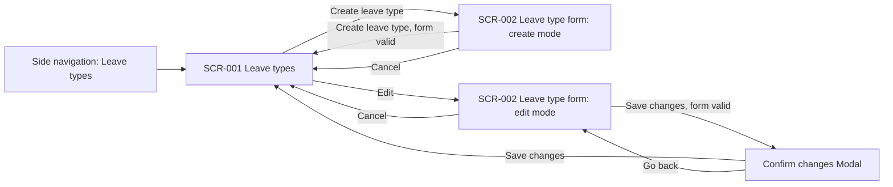

# UC-007 — Manage leave types: Functional UI

## Purpose

Admin/HR (ACT-004) keeps the leave types in line with company policy (BP-003, REQ-007). For each leave type they set:

- who can use it: the gender eligibility (BR-004);
- how many days an employee gets: the base days and, for a seniority-based type, the years of service per extra day (BR-003, ASM-010);
- which documents an employee must upload with a request (BR-005).

Admin/HR arrives from the side navigation item **Leave types**, which opens the list (SCR-001). From there they create a leave type or edit one in the form (SCR-002). After saving they are back on the list, which shows the new values.

This use case covers creating and editing only. There is no delete or deactivate action: UC-007 and the security rules give Admin/HR create and edit on leave types, nothing else.

## Screens

### SCR-001 — Leave types

- **Route / entry point:** `/leave-types` — reached from the side navigation item **Leave types**, and from SCR-002 after saving or cancelling.
- **Purpose:** Show every leave type with its rules, and start creating or editing one.
- **Actors:** ACT-004

#### Sections

1. Page header — title "Leave types", description "The leave types employees can request, and the rules each request is checked against.", and the primary Button **Create leave type** on the right.
2. Leave type Table — one row per leave type, with an **Edit** row action. Below 768 px each row becomes a Card: the name as the card title, the other columns as label and value pairs, and the **Edit** button at the bottom.
3. Pagination — below the Table, page size 20, 50 or 100. Hidden when there are 20 leave types or fewer.

The list has no Filter bar: the number of leave types is small (eight are suggested in ENT-004).

#### Fields

None. The screen has no input fields.

#### Actions

| Action | Enabled when | Result | Rule |
|---|---|---|---|
| Create leave type (Button, primary) | Always | Opens SCR-002 in create mode | REQ-007 |
| Edit (Button, link, one per row) | Always | Opens SCR-002 in edit mode for that leave type | REQ-007 |
| Sort by a column header | The column is sortable | Reorders the list. The sort is kept in the URL | — |
| Change page or page size | More than 20 leave types | Shows the chosen page. Page and size are kept in the URL | — |
| Retry (Button, default) | The list failed to load | Loads the list again | — |

#### Table columns

| Column | Source | Sortable | Notes |
|---|---|---|---|
| Name | ENT-004.name | Yes | Default sort, A to Z |
| Eligibility | ENT-004.gender_eligibility | No | "All employees", "Female only" or "Male only" (options pending Q-023) |
| Base days | ENT-004.base_days | Yes | Days a year with halves, such as `12 days` or `12.5 days` |
| Seniority rule | ENT-004.seniority_based, ENT-004.years_per_extra_day | No | "1 extra day per 5 years of service" when the type is seniority-based, otherwise "None" |
| Required documents | ENT-004.required_documents | No | Document names separated by commas, or "None" |
| Actions | — | No | **Edit** |

#### States

| State | What the user sees |
|---|---|
| Loading | Skeleton in the shape of the Table: header row and five rows |
| Empty | Empty state with the sentence "No leave types yet. Create the first one so employees can request leave." and the **Create leave type** button |
| Populated | The Table with every leave type, sorted by name |
| Validation error | Does not apply: the screen has no input |
| Server error | Alert (error) in place of the Table: "We could not load the leave types." with the **Retry** button and the trace ID |
| Success | After a save on SCR-002: the list is loaded again with the new values and a Notification confirms the save |
| No access | The no-access page: the user's role cannot open this area, with a link home |

#### Messages

| Trigger | Message text | Type | Rule |
|---|---|---|---|
| No leave type exists | "No leave types yet. Create the first one so employees can request leave." | Empty state | REQ-007 |
| The list fails to load | "We could not load the leave types. Try again. Trace ID: {traceId}" | Alert (error) | — |
| A leave type was created on SCR-002 | "Leave type "{name}" created." | Notification (success) | REQ-007 |
| A leave type was changed on SCR-002 | "Leave type "{name}" updated." | Notification (success) | REQ-007 |
| A user who is not Admin/HR opens the route | "Your role cannot open leave types." with the link "Go to home" | No-access page | BR-014 |

### SCR-002 — Leave type form

- **Route / entry point:** `/leave-types/new` (create mode) — reached from **Create leave type** on SCR-001. `/leave-types/{leaveTypeId}/edit` (edit mode) — reached from **Edit** on a row of SCR-001.
- **Purpose:** Create a leave type, or change the rules of an existing one.
- **Actors:** ACT-004

#### Sections

1. Page header — title "Create leave type" in create mode, "Edit leave type: {name}" in edit mode, with a link "Back to leave types" above the title.
2. Effect notice — Alert (info) that says when the saved values start to apply (text under Messages; pending Q-021).
3. Error summary — Alert (error) above the form, shown only after a save attempt with errors. It lists each problem as a link to its field.
4. General — the name of the leave type.
5. Eligibility — who can use the leave type (BR-004).
6. Entitlement rule — the base days, whether the entitlement grows with years of service, and the years of service per extra day (BR-003). A help text below the fields restates the rule in words with a worked example, updated as the values change.
7. Required documents — the documents an employee must upload with a request of this type (BR-005). One row per document, each with a **Remove** action, and an **Add document** button below the rows. With no rows the section shows "No documents required".
8. Form actions — the primary Button (**Create leave type** or **Save changes**) and **Cancel**.
9. Confirm changes Modal (edit mode only) — opens from **Save changes**. It names the leave type, lists each changed value as old value → new value, and repeats the effect notice. Buttons: **Save changes** and **Go back**.
10. Discard changes Modal — opens when the user leaves the form with unsaved changes. Buttons: **Discard changes** and **Keep editing**.

The form is a single column, at most 640 px wide, with labels above the fields.

#### Fields

| Field | Control | Required | Source | Validation | Rule |
|---|---|---|---|---|---|
| Name | Form field, text input | Yes | ENT-004.name | Not empty after spaces at the start and end are removed. At most 100 characters. Not the name of another leave type, ignoring upper and lower case; checked when saving. Length limit and uniqueness pending Q-022 | REQ-007 |
| Who can use this leave type | Select with the options "All employees", "Female only", "Male only" (pending Q-023). Create mode starts on "All employees" | Yes | ENT-004.gender_eligibility | One option is chosen | BR-004 |
| Base days per year | Form field, number input with the suffix "days" | Yes | ENT-004.base_days | A number of 0 or more, in steps of 0.5 (BR-017). At most 365. Whether 0 is allowed and the maximum are pending Q-022 | BR-003 |
| Entitlement grows with years of service | Form field, checkbox. Create mode starts unticked | No | ENT-004.seniority_based | None | BR-003 |
| Years of service per extra day | Form field, number input with the suffix "years". Shown only when "Entitlement grows with years of service" is ticked. Unticking the checkbox hides the field and clears its value | Yes, when shown | ENT-004.years_per_extra_day | A whole number of 1 or more. At most 50; the maximum is pending Q-022 | BR-003 |
| Required documents | A list of Form fields, text input, one per document name. Create mode starts with no rows. Behaviour pending Q-020 | No | ENT-004.required_documents | Each row: not empty, at most 100 characters, and not the same as another row, ignoring upper and lower case | BR-005 |

Fields are validated when the user leaves them, and the whole form is validated on save.

#### Actions

| Action | Enabled when | Result | Rule |
|---|---|---|---|
| Create leave type (Button, primary; create mode) | No save is running | Validates the form. Valid: saves the leave type, opens SCR-001 and shows the success Notification. Not valid: shows the error summary and the field messages, and moves focus to the summary | REQ-007 |
| Save changes (Button, primary; edit mode) | At least one value differs from the saved leave type, and no save is running | Validates the form. Valid: opens the Confirm changes Modal. Not valid: shows the error summary and the field messages, and moves focus to the summary | REQ-007 |
| Save changes (Button, primary; in the Confirm changes Modal) | No save is running | Saves the changes, opens SCR-001 and shows the success Notification | REQ-007 |
| Go back (Button, default; in the Confirm changes Modal) | Always | Closes the Modal. The form keeps the entered values | — |
| Add document (Button, default) | Always | Adds an empty document row and moves focus to it | BR-005 |
| Remove (Button, link; one per document row) | Always | Removes that row | BR-005 |
| Cancel (Button, default), and the link "Back to leave types" | No save is running | No unsaved changes: opens SCR-001. Unsaved changes: opens the Discard changes Modal | — |
| Discard changes (Button, danger; in the Discard changes Modal) | Always | Drops the entered values and opens SCR-001. Nothing is saved | — |
| Keep editing (Button, default; in the Discard changes Modal) | Always | Closes the Modal. The form keeps the entered values | — |
| Retry (Button, default) | The leave type failed to load in edit mode | Loads the leave type again | — |
| Reload (Button, default) | Someone else changed the leave type during editing | Loads the latest saved values into the form. The user's unsaved entries are dropped | — |

#### States

| State | What the user sees |
|---|---|
| Loading | Edit mode: Skeleton in the shape of the form while the leave type loads. Create mode: the form shows at once |
| Empty | Create mode: an empty form. Eligibility is "All employees", the seniority checkbox is unticked, and the Required documents section shows "No documents required" |
| Populated | Edit mode: the form holds the saved values of the leave type. **Save changes** is disabled until a value changes |
| Saving | The primary button shows a loading indicator and is disabled. The fields and **Cancel** cannot be used until the save ends |
| Validation error | The error summary above the form lists each problem as a link to its field, and each message shows under its field in the error colour. Entered values are kept. Focus moves to the summary |
| Server error | Load failure in edit mode: Alert (error) in place of the form, with **Retry** and the trace ID. Save failure: Alert (error) above the form with the trace ID; entered values are kept and the primary button is enabled again. Leave type not found: a message in place of the form with the link "Back to leave types". Changed by someone else: Alert (error) above the form with the **Reload** button |
| Success | SCR-001 opens and shows the Notification for the created or updated leave type |
| No access | The no-access page: the user's role cannot open this area, with a link home |

#### Messages

| Trigger | Message text | Type | Rule |
|---|---|---|---|
| Form opens in create mode | "Employees get an entitlement for a new leave type at the next annual refresh, at the start of the year." | Alert (info) | Pending Q-021 |
| Form opens in edit mode | "Changes to the base days or the years per extra day apply from the next annual refresh. Entitlements already calculated for this year stay the same. Changes to eligibility and required documents apply to requests submitted after you save." | Alert (info) | Pending Q-021 |
| Entitlement rule values change; the type is not seniority-based | "Each eligible employee gets {base days} days a year." | Help text | BR-003 |
| Entitlement rule values change; the type is seniority-based | "Each eligible employee gets {base days} days a year, plus 1 day for every {N} years of service. Example: {2 × N} years of service gives {base days + 2} days." | Help text | BR-003 |
| Eligibility field | "An employee who is not eligible cannot request this leave type." | Help text | BR-004 |
| Required documents section | "An employee must upload every document listed here to submit a request of this type. Leave the list empty if no document is needed." | Help text | BR-005 |
| Save with errors | "Fix {n} problems before saving." followed by one link per problem | Alert (error), error summary | — |
| Name is empty | "Enter a name for the leave type." | Field error | REQ-007 |
| Name is longer than 100 characters | "Use 100 characters or fewer for the name." | Field error | Pending Q-022 |
| Name is already used by another leave type | "A leave type named "{name}" already exists. Choose a different name." | Field error | Pending Q-022 |
| No eligibility option is chosen | "Choose who can use this leave type." | Field error | BR-004 |
| Base days is empty | "Enter the base days per year." | Field error | BR-003 |
| Base days is negative, not a number, or not a multiple of 0.5 | "Enter 0 or more days in steps of half a day, for example 12 or 12.5." | Field error | BR-003 |
| Base days is above 365 | "Enter 365 days or fewer." | Field error | Pending Q-022 |
| Years of service per extra day is empty while the checkbox is ticked | "Enter the years of service that earn one extra day." | Field error | BR-003 |
| Years of service per extra day is not a whole number of 1 or more | "Enter a whole number of years, 1 or more." | Field error | BR-003 |
| Years of service per extra day is above 50 | "Enter 50 years or fewer." | Field error | Pending Q-022 |
| A document row is empty | "Enter the document name, or remove this row." | Field error | BR-005 |
| A document name is longer than 100 characters | "Use 100 characters or fewer for the document name." | Field error | BR-005; pending Q-020 |
| Two document rows have the same name | "This document is already listed. Remove one of the two rows." | Field error | BR-005 |
| Save changes in edit mode, form valid | Title: "Save changes to {name}?" Body: the list of changed values, such as "Base days per year: 12 days → 14 days", followed by the text of the edit-mode effect notice | Modal | BR-003, BR-004, BR-005; pending Q-021 |
| Leaving the form with unsaved changes | Title: "Discard your changes?" Body: "The changes you made to this leave type will not be saved." | Modal | — |
| The leave type fails to load in edit mode | "We could not load this leave type. Try again. Trace ID: {traceId}" | Alert (error) | — |
| The save fails for an unexpected reason | "We could not save the leave type. Your entries are still here. Try again. Trace ID: {traceId}" | Alert (error) | — |
| Someone else changed the leave type during editing | "Someone else changed this leave type while you were editing. Reload to see the latest values, then make your changes again." | Alert (error) | — |
| The leave type in the URL does not exist | "This leave type does not exist." with the link "Back to leave types" | Alert (error) | — |
| A user who is not Admin/HR opens the route | "Your role cannot open leave types." with the link "Go to home" | No-access page | BR-014 |

The success messages of this form are shown on SCR-001 and listed there.

## Navigation

Cancel with unsaved changes passes through the Discard changes Modal first.

## Permissions

| Actor / role | Can see | Can do | Rule |
|---|---|---|---|
| ACT-004 Admin/HR | The **Leave types** item in the side navigation, SCR-001 and SCR-002 | Create a leave type; edit every rule of an existing leave type | REQ-007, BR-014 |
| ACT-001 Employee, ACT-002 Project Manager, ACT-003 Line Manager | Neither screen. The navigation item is hidden, and opening a route directly shows the no-access page | Nothing on these screens. They meet leave types only where other use cases show them, such as the request form | BR-014 |

The server enforces these permissions; hiding the navigation item is a convenience only.

## Open Questions

- Q-020 — How are the documents a leave type can require defined: typed per leave type, or chosen from a fixed list kept elsewhere? Assumed until answered: Admin/HR types each document name on the form (Required documents section of SCR-002), and every listed document is mandatory for the employee.
- Q-021 — When does a change to a leave type take effect? Assumed until answered: a change to the entitlement rule, and a new leave type, apply from the next annual refresh; entitlements already calculated for the current year do not change. A change to eligibility or required documents applies to requests submitted after the save; requests already submitted are not checked again. The effect notice and the Confirm changes Modal of SCR-002 say this.
- Q-022 — Which limits apply to a leave type? Assumed until answered: the name is unique and at most 100 characters; base days is between 0 and 365, so a type with no yearly entitlement is entered with 0; the years of service per extra day is between 1 and 50.
- Q-023 — Which gender values does the HR system provide, and which eligibility options must a leave type offer? Assumed until answered: "All employees", "Female only" and "Male only".

Assumption in use: ASM-010 — the base days and the years of service per extra day are configured per leave type by Admin/HR.
