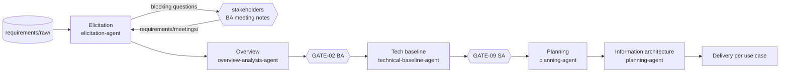

# How the BA workflow runs

This is the human-readable companion to [workflow.yaml](workflow.yaml), which is the definition the tools actually read. Background: [master spec](../../docs/master-spec.md) and [implementation decisions](../../docs/implementation-decisions.md) (milestone 2: §13).

## The idea in one paragraph

Every step reads defined inputs and writes a defined artifact. Every artifact records the exact inputs it was built from (`built_from` with content hashes). Humans approve at gates, and an approval is tied to the exact content approved. The workflow's position is never stored as "where we were". `tools/ba` **derives** it from which artifacts exist, whether they are stale or invalid, and what each gate says. That is why it can stop and resume anywhere, including in a brand-new session.

## Routes

| Mode | When | Route (built engines in **bold**) |
|---|---|---|
| MODE_A | Existing product | Reverse engineering → GATE-01 → Tech baseline (inferred) → GATE-09 → **Elicitation → Overview** → GATE-02 → **Planning → IA → Delivery** |
| MODE_B | New product / large change | **Elicitation → Overview → GATE-02 → Tech baseline (designed) → GATE-09 → Planning → IA → Delivery** |
| MODE_C | Small change request | CR intake → Impact analysis → **Delivery** (spec updates onwards) |

*Delivery* runs per use case: **Spec Engine → GATE-05 → GATE-06 → acceptance tests → coding → QA + fix loop → GATE-10 → [GATE-07] → user guide → GATE-08** (D-37, D-38).

Every human gate except GATE-07 is preceded by an **AI pre-review**: a `review-agent` with a fresh context checks the artifacts first, at most 2 rounds (D-40).

MODE_A and MODE_C still stop at their first step that has no engine (reverse engineering, CR intake).

## MODE_B, run level

| Step | Complete when | Next action otherwise |
|---|---|---|
| Elicitation | GATE-02 approved, or: the summary exists, is current and valid, requirements exist, and no **blocking** open question is OPEN | GENERATE / REGENERATE (new meeting notes) / FIX, or **WAIT_FOR_STAKEHOLDERS** |
| Overview | GATE-02 approved, or: the product overview and all its catalogs exist and are valid | GENERATE / REGENERATE / FIX, then request GATE-02 |
| Tech baseline | GATE-09 approved, or: the 5 documents and the services and repositories catalogs exist and are valid | GENERATE / REGENERATE / FIX, then request GATE-09 |
| Planning | Every use case in the catalog is in a backlog epic, and the backlog is valid | GENERATE / REGENERATE (unplanned use cases) / FIX |
| Information architecture | Every application marked `information_architecture: REQUIRED` has a current IA document | GENERATE / REGENERATE / FIX |

The stakeholder conversation (master §8 step 2.5) is the BA's. While a question marked `blocking: true` is OPEN, the run waits (WAITING_FOR_HUMAN). The BA's notes in `requirements/meetings/` make the elicitation summary STALE, and the elicitation agent consolidates them.

## Delivery, per use case

```mermaid
flowchart LR
  C[5.1 Context<br/>tools/ba context] --> U[5.2 UI markdown<br/>ui-agent]
  U --> G3{{GATE-03}}
  G3 --> P[5.3 Prototype<br/>ui-agent]
  P --> G4{{GATE-04}}
  G4 --> S[5.4–5.6 Sequence · API · Validation<br/>technical-analysis-agent]
  S --> AC[5.7–5.8 Acceptance criteria · Spec<br/>spec-agent]
  AC --> G5{{GATE-05 BA}}
  G5 --> G6{{GATE-06 SA}}
  G6 --> T[8.1 Acceptance tests first<br/>qa-agent]
  T --> K[7 Implementation<br/>coding-agent]
  K --> Q[8.2 Run tests · compare<br/>qa-agent]
  Q -->|CODE_DEFECT| F[8.4 Fix<br/>coding-agent]
  F --> Q
  Q -->|TEST_ISSUE| T
  Q -->|spec gap / env / unresolved| H{{human}}
  Q -->|passed| G10{{GATE-10 code review}}
  G10 --> G7{{GATE-07<br/>risky only}}
  G7 --> UG[9 User guide<br/>documentation-agent]
  UG --> G8{{GATE-08}}
```

- **Starting.** A use case starts when GATE-02 and GATE-09 are approved, its backlog status is READY, and the use cases it depends on have GATE-05 approved. Independent use cases run in parallel.
- **Product repositories.** The first time a use case needs them, a shared step 7.0 creates the repositories the baseline lists. Each use case then works in its own git worktree, `<repo>-worktrees/<UC>/` on branch `ba/<UC>-<slug>`, so use cases can be coded in parallel (D-39).
- **Tests come first.** The QA agent writes the acceptance tests from the approved spec before any code exists. The coding agent makes them pass and may not edit them (D-38).
- **Coding** needs `tools/ba coding authorize <UC>`. It checks GATE-05, GATE-06 and GATE-09 (D-13). Nothing is pushed or opened as a pull request unless asked.
- **QA** classifies every failure (master §25 step 8.3):
  - a CODE_DEFECT goes to the fix loop, at most 3 times per defect (D-26);
  - a TEST_ISSUE goes back to the QA agent;
  - anything else waits for a human. After a human fix: `tools/ba qa retest <UC>`.
- **Code review comes after QA** (D-37). The fix loop runs to green with no human in between. The developer then reviews the final, tested code once.
- **GATE-07** applies only when the use case's `risk_level` is HIGH or CRITICAL, or it has any risk flag (D-23).
- **The user guide** is written from the implemented application, with real screenshots (Playwright from the frontend repository).

## How `tools/ba next` decides a use case's next action

For each step 5.2 → 9, in order:

0. The step needs the product repositories and one is missing → **SETUP_REPOSITORIES** (shared, runs once).
1. The artifact is missing → **GENERATE**.
2. An input it was built from changed → **REGENERATE** (only what the change affects).
3. It fails validation → **FIX**.
4. Test results only: route the failures by classification → **FIX_TESTS**, **FIX_DEFECT** or **NEEDS_HUMAN**.
5. The step ends at a gate (skipped if the gate doesn't apply, as GATE-07 for low-risk use cases):
   - no request yet, or the content changed since → first the **PRE_REVIEW** (AI reviewer; its findings come back as **REVISE** to the owner, at most 2 rounds), then **REQUEST_GATE**;
   - request open → **WAITING** for the human;
   - changes requested → **REVISE** with the reviewer's comments;
   - approved → continue to the next step.

Reviewer comments stay attached to the actions until the gate is requested again.

## Gate states

| State | Meaning |
|---|---|
| NOT_REQUESTED | No review requested yet |
| WAITING | Requested; the artifacts are exactly as submitted |
| APPROVED | Approved, and the content and its inputs are unchanged since |
| CHANGES_REQUESTED | Reviewer asked for changes; artifacts not yet revised |
| OUTDATED | Artifacts changed after the request/decision; needs a new request |
| INVALIDATED | Was approved, but the content or one of its inputs changed since |
| BLOCKED | Reviewer blocked it (e.g. GATE-06) |

Only content counts. Updating `status`, `review`, `version`, `updated_at` or `built_from` never changes a hash. So re-stamping an artifact whose content didn't change keeps its approval.

## Who writes what

| File | Written by |
|---|---|
| Use-case artifacts (`ui/`, `technical/sequence|api|implementation/<UC>.md`, `specifications/`, `qa/`, `user-guide/<UC>/`) | The agent working on that use case |
| Run-level documents (`requirements/elicitation/`, `overview/product-overview.md`, the technical baseline, `planning/information-architecture/`) | The agent of that run step |
| Catalogs (`overview/*.yaml`, `requirements/*.yaml`, `ui/screen-catalog.yaml`, `technical/api/api-catalog.yaml`, `technical/architecture/services.yaml`, `workflow/repositories.yaml`) | `tools/ba catalog add|update` only (locked) |
| `planning/backlog.yaml` | `tools/ba backlog plan` (planning) and `tools/ba sync` (derived fields); the BA may edit priority, status and dependencies |
| `workflow/state.json`, `knowledge/*` | `tools/ba sync` / `tools/ba coding` only |
| `reviews/requests/` | `tools/ba gate request` |
| `reviews/pre-review/` | `tools/ba prereview record` (the review agent's verdict; never a decision) |
| `specifications/use-cases/<UC>.md` | `tools/ba compile` (13 generated sections) + `spec-agent` (7 narrative sections) |
| `reviews/decisions/` | The UserPromptSubmit hook when the human types `/ba-approve` or `/ba-changes` (or `tools/ba decide` in the human's own terminal) |
| Product repositories | `coding-agent` (setup and code) and `qa-agent` (acceptance tests), in the use case's worktree, only for an authorized use case |
